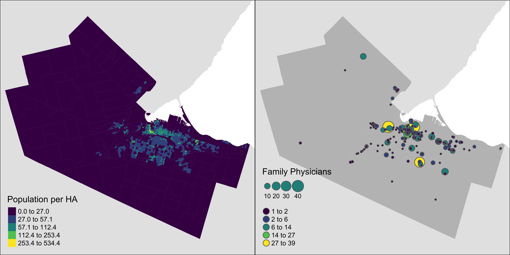
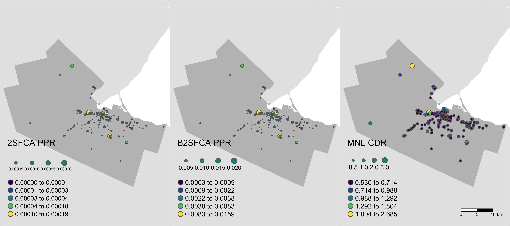
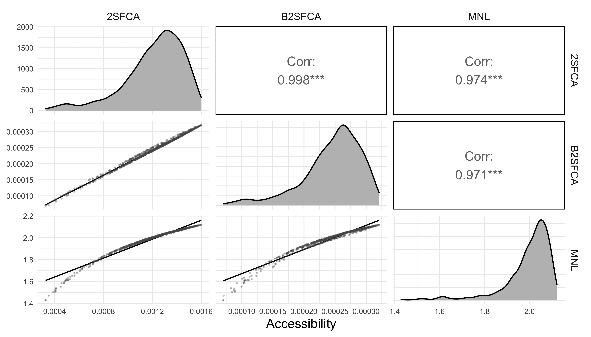
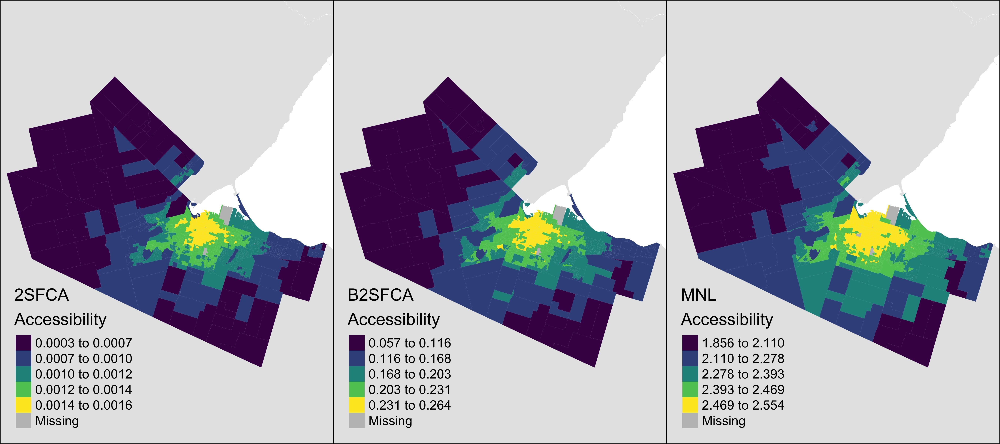
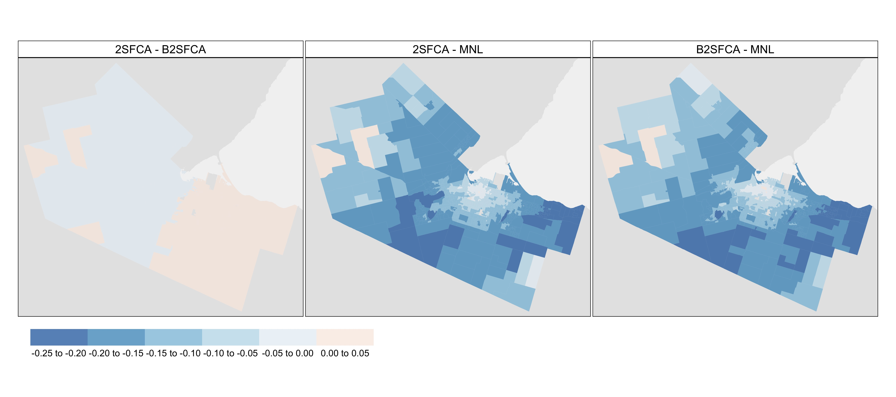

```{r load packages, include = FALSE}
library(GGally)
library(magrittr)
library(sf)
library(spdep)
library(tidyverse)
library(tmap)

# options
tmap_mode("plot")
ggplot2::theme_set(ggplot2::theme_minimal())
knitr::opts_chunk$set(echo = FALSE)
```

```{r clear environment}
rm(list = ls())
```

```{r load results}
load("./results/output_workbook_01.RData")
```

```{r prepare fig 1, include = FALSE}
pop_dens_map <- tm_shape(ontario_poly, bbox = st_bbox(data_da_2016_poly)) + 
  tm_fill("grey90") +
  tm_shape(data_da_2016_poly) + 
  tm_fill(col = "popdens", palette = "viridis", style = "jenks", title = "Population per HA")  +
  tm_layout(legend.position = c("left","bottom")) #+tm_layout(inner.margins = c(0,0,0,0))

doctors_map <- tm_shape(ontario_poly, bbox = st_bbox(data_da_2016_poly)) + 
  tm_fill("grey90") +
  tm_shape(data_da_2016_poly) + 
  tm_fill("grey75") +
  tm_shape(doctors) + 
  tm_bubbles(size = "doctor_count", 
             col = "doctor_count", 
             palette = "viridis", 
             style = "jenks", 
             title.size = "Family Physicians", 
             title.col = "") +
  tm_layout(legend.position = c("left","bottom")) #+tm_layout(inner.margins = c(0,0,0,0))

study_area_map <- tmap_arrange(pop_dens_map, doctors_map, nrow = 1, outer.margins = c(0, 0, 0, 0))
tmap_save(study_area_map, filename = "./img/study_area_map.jpg", dpi = 600, width = 9, height = 4.5)
```

```{r prepare pair plots, message = FALSE, warning = FALSE}
# lower triangle custom function
lowerfun <- function(data,mapping){
  ggplot(data = data, mapping = mapping) +
    geom_smooth(method='lm', formula= y~x, colour="black", size = .5) +
    geom_point(alpha = 0.3, size = 0.2, color = "gray35")}

# diagonal element custom function
diagfun <- function(data, mapping) {
  ggplot(data = data, mapping=mapping) +
    geom_density(fill = "gray")}

# calculate capacity-to-demand ratio for MNL results
doctors %<>% mutate(mnl_cdr = 1/mnl_dcr)

pair_plot_ppr <- ggpairs(doctors %>% st_drop_geometry() %>% drop_na(), 
        columns = c("fca_ppr", "bfca_ppr", "mnl_cdr"), xlab = "Level of Service Ratios", 
        diag = list(continuous = wrap(diagfun)),
        lower = list(continuous = wrap(lowerfun)),
        columnLabels = c("2SFCA", "B2SFCA", "MNL"))

pair_plot_access <- ggpairs(data_da_2016_poly %>% st_drop_geometry() %>% drop_na(), 
        columns = 12:14, xlab = "Accessibility", 
        diag = list(continuous = wrap(diagfun)),
        lower = list(continuous = wrap(lowerfun)),
        columnLabels = c("2SFCA", "B2SFCA", "MNL"))

# save
ggsave(pair_plot_ppr, filename = "./img/pair_plot_ppr.jpg", device = "jpeg", dpi = 600, height = 4, width = 7)
ggsave(pair_plot_access, filename = "./img/pair_plot_access.jpg", device = "jpeg", dpi = 600, height = 4, width = 7)
```

```{r prepare los_maps, include = FALSE}
los_map_fca <- tm_shape(ontario_poly, bbox = st_bbox(data_da_2016_poly)) + 
  tm_fill("grey90") +
  tm_shape(data_da_2016_poly) + 
  tm_fill("grey75") +
  tm_shape(doctors) + 
  tm_bubbles(size = "fca_ppr", 
             scale = .6,
             #n = 4,
             col = "fca_ppr", 
             palette = "viridis", 
             style = "jenks", 
             title.size = "2SFCA PPR", 
             title.col = "") +
  tm_layout(legend.position = c("left","bottom"))

los_map_bfca <- tm_shape(ontario_poly, bbox = st_bbox(data_da_2016_poly)) + 
  tm_fill("grey90") +
  tm_shape(data_da_2016_poly) + 
  tm_fill("grey75") +
  tm_shape(doctors) + 
  tm_bubbles(size = "bfca_ppr", 
             scale = .6,
             #n = 4,
             col = "bfca_ppr", 
             palette = "viridis", 
             style = "jenks", 
             title.size = "B2SFCA PPR", 
             title.col = "") +
  tm_layout(legend.position = c("left","bottom"))

los_map_mnl <- tm_shape(ontario_poly, bbox = st_bbox(data_da_2016_poly)) + 
  tm_fill("grey90") +
  tm_shape(data_da_2016_poly) + 
  tm_fill("grey75") +
  tm_shape(doctors) + 
  tm_bubbles(size = "mnl_cdr", 
             scale = .6,
             #n = 4,
             col = "mnl_cdr", 
             palette = "viridis", 
             style = "jenks", 
             title.size = "MNL CDR", 
             title.col = "") +
  tm_layout(legend.position = c("left","bottom"))

los_maps <- tmap_arrange(los_map_fca, los_map_bfca, los_map_mnl, nrow = 1, outer.margins = c(0, 0, 0, 0))
tmap_save(los_maps, filename = "./img/los_maps.jpg", dpi = 600, width = 9, height = 4)
```

```{r access maps, include = FALSE}
access_map_fca <- tm_shape(ontario_poly, bbox = st_bbox(data_da_2016_poly)) + 
  tm_fill("grey90") +
  tm_shape(data_da_2016_poly) + 
  tm_fill(col = "fca_access", palette = "viridis", style = "jenks", title = "2SFCA\nAccessibility")  +
  tm_layout(legend.position = c("left","bottom"))

access_map_bfca <- tm_shape(ontario_poly, bbox = st_bbox(data_da_2016_poly)) + 
  tm_fill("grey90") +
  tm_shape(data_da_2016_poly) + 
  tm_fill(col = "bfca_access", palette = "viridis", style = "jenks", title = "B2SFCA\nAccessibility")  +
  tm_layout(legend.position = c("left","bottom"))

access_map_mnl <- tm_shape(ontario_poly, bbox = st_bbox(data_da_2016_poly)) + 
  tm_fill("grey90") +
  tm_shape(data_da_2016_poly) + 
  tm_fill(col = "mnl_access", palette = "viridis", style = "jenks", title = "MNL\nAccessibility")  +
  tm_layout(legend.position = c("left","bottom"))

access_maps <- tmap_arrange(access_map_fca, access_map_bfca, access_map_mnl, nrow = 1, outer.margins = c(0, 0, 0, 0))
tmap_save(access_maps, filename = "./img/access_maps.jpg", dpi = 600, width = 9, height = 4)
```

```{r define functions}
# create local moran classifier function
local_moran_classifier <- function(input_var, p_value, w_matrix){
  s_var = as.vector(scale(input_var))
  w_var = lag.listw(w_matrix, var = s_var)
  classified = ifelse(s_var > 0 & w_var > 0 & p_value <=0.05, "HH",
                       ifelse(s_var <= 0 & w_var <= 0 & p_value <=0.05, "LL",
                              ifelse(s_var > 0 & w_var <= 0 & p_value <=0.05, "HL",
                                     ifelse(s_var <= 0 & w_var > 0 & p_value <=0.05, "LH",
                                            "NS"))))
  return(classified) 
}

# local moran classification colour palette
locm_palette <- c("#E08C80", "#7BB0D2", "#F9F9F9")

# normalize function
norm_x <- function(x){
  n_x = (x - min(x, na.rm = TRUE))/(max(x, na.rm = TRUE) - min(x, na.rm = TRUE))
  return(n_x)
}
```

```{r}
# prepare data by taking differences
da_poly <- data_da_2016_poly %>% 
  select(GeoUID, fca_access, bfca_access, mnl_access, geometry) %>% 
  drop_na(mnl_access) %>%
  mutate(n_fca_access = norm_x(fca_access),
         n_bfca_access = norm_x(bfca_access),
         n_mnl_access = norm_x(mnl_access),
         diff_fca_bfca = n_fca_access - n_bfca_access,
         diff_fca_mnl = n_fca_access - n_mnl_access,
         diff_bfca_mnl = n_bfca_access - n_mnl_access)

diff_list <- c("diff_fca_bfca", "diff_fca_mnl", "diff_bfca_mnl")

# get spatial weights
da_poly_queen <- poly2nb(pl = da_poly, queen=TRUE)
da_poly_queen_W <- nb2listw(neighbours = da_poly_queen, style = "W")
```

```{r moran classification}
# get local moran's I p-values
lmpv_list <- list()
for (i in diff_list){
  local_m <- as.data.frame(localmoran(x = da_poly[[i]], listw = da_poly_queen_W))
  # create new variable name for p value and rename
  pv_varname = paste0("lmpv_", i)
  local_m <- local_m %>% rename(!!pv_varname := `Pr(z > 0)`) %>% select(!!pv_varname)
  lmpv_list[[i]] <- local_m}

# cbind to the original da polys
da_poly %<>% cbind(bind_cols(lmpv_list))

# classify p values
lm_class_list <- list()
for (i in diff_list){
  #input_varname = 
  pv_varname = paste0("lmpv_", i)
  out_varname <- paste0("lmc_", i)
  lm_class <- da_poly %>% 
    st_drop_geometry() %>% 
    mutate(!!out_varname := local_moran_classifier(.data[[i]], get(pv_varname), da_poly_queen_W))
  lm_class_list[[i]] <- lm_class %>% select(!!out_varname)
}

# cbind to the original da polys
da_poly %<>% cbind(bind_cols(lm_class_list)) 
```

```{r access diff maps, include = FALSE}
# convert to long format
da_poly_diff_long <- da_poly %>%
  pivot_longer(starts_with("diff"), names_to = "name", values_to = "values") %>% 
  mutate(name = fct_relevel(name, "diff_fca_bfca", "diff_fca_mnl", "diff_bfca_mnl")) %>%
  st_sf()
                
access_diff_maps <- tm_shape(ontario_poly, bbox = st_bbox(data_da_2016_poly)) + 
  tm_fill("grey90") +
  tm_shape(da_poly_diff_long) +
  tm_fill(col = "values", 
          alpha = .75, 
          #style = 'fixed', 
          #breaks = div_breaks, 
          palette = "-RdBu",
          midpoint = 0,
          title = "", #"Accessibility Difference Hot Spots",
          legend.is.portrait=FALSE) +
  tm_facets("name", nrow = 1) +
  tm_layout(bg.color = "grey95", 
            legend.outside = TRUE,
            legend.outside.position = c("bottom"),
            legend.outside.size = .1,
            #legend.position = c(0.01, 1),
            #legend.stack = "horizontal",
            between.margin = 0.1,
            panel.labels = c("2SFCA - B2SFCA", "2SFCA - MNL", "B2SFCA - MNL"),
            panel.label.bg.color = NA,
            panel.label.size = .75)

tmap_save(access_diff_maps, filename = "./img/access_diff_maps.jpg", dpi = 600, width = 9, height = 4)
```

```{r local moran maps, include = FALSE}
da_poly_lmc_long <- da_poly %>%
  pivot_longer(starts_with("lmc"), names_to = "name", values_to = "values") %>% 
  mutate(name = fct_relevel(name, "lmc_diff_fca_bfca", "lmc_diff_fca_mnl", "lmc_diff_bfca_mnl")) %>%
  st_sf()

access_locm_maps <- tm_shape(ontario_poly, bbox = st_bbox(data_da_2016_poly)) + 
  tm_fill("grey90") +
  tm_shape(da_poly_lmc_long) +
  tm_fill(col = "values", 
          alpha = .75, 
          #style = 'fixed', 
          #breaks = div_breaks, 
          palette = locm_palette, 
          title = "", #"Accessibility Difference Hot Spots",
          legend.is.portrait=FALSE) +
  tm_facets("name", nrow = 1) +
  tm_layout(bg.color = "grey95", 
            legend.outside = TRUE,
            legend.outside.position = c("bottom"),
            legend.outside.size = .1,
            legend.position = c(0.01, 1),
            #legend.stack = "horizontal",
            between.margin = 0.1,
            panel.labels = c("2SFCA - B2SFCA", "2SFCA - MNL", "B2SFCA - MNL"),
            panel.label.bg.color = NA,
            panel.label.size = .75)

tmap_save(access_locm_maps, filename = "./img/access_locm_maps.jpg", dpi = 600, width = 9, height = 4)
```

# Introduction

The COVID-19 global pandemic has emphasized the importance of healthcare accessibility, particularly access to primary care physicians, who provide the first point of contact between patients and the healthcare system. In Canada, the Canada Health Act states that all residents should have "reasonable access" to healthcare. However, the 2017 Canadian Community Health Survey revealed that 15.3% of Canadians aged 12 or over did not have a primary care physician, of whom 17.2% stated that there is no physician accessible within their area [@statcan2019].

Accessibility to healthcare services is defined by both spatial and aspatial components [@joseph1982]. Aspatial factors include the cost and quality of healthcare services and the socioeconomic, demographic, and mobility profile of potential users [@joseph1982]. The second component considers geographic accessibility, which can be defined as the potential to interact with a given set of opportunities, such as healthcare facilities or primary care physicians, from a given location using the transportation network [@hansen1959]. Accessibility to healthcare can therefore be improved through either an increase in the number of available opportunities or through improvements to the transportation network.

In general, four approaches for calculating accessibility exist: infrastructure-based approaches, which focus on the capacity of transportation infrastructure; location-based approaches, which focus on spatial distributions of opportunities; person-based approaches, which focus on accessibility on an individual level; and utility-based measures, which focus on the utility derived from interacting with the opportunity or participating in an activity [@geurs2004]. Of these, place-based measures are the most common in the literature and, of these, the family of "floating catchment area" (FCA) methods is one of the most popular approaches for calculating place-based healthcare accessibility. Because healthcare access is sensitive to demand and supply, Luo and Wang [@luo2003] (drawing on Radke and Mu [-@radke2000]) introduced the Two-step Floating Catchment Area (2SFCA) method that first estimates the demand for healthcare at service locations from population zones and then allocates the level of service back to the population zones using a binary measure of travel impedance.

Since then, various improvements have been made to the 2SFCA approach to better capture the friction of distance. The original 2SFCA has been criticized for over-estimating demand and under-estimating levels of service in the estimation of accessibilities due to the multiple-counting of populations that arises from the overlapping catchments in a study area. In response, researchers have proposed solutions such as the Three-step Floating Catchment Area (3SFCA) [@wan2012], Modified 2SFCA (M2SFCA) [@delamater2013], and Balanced 2SFCA (B2SFCA) [@paez2019] methods. Of these, the B2SFCA is the only approach that preserves the original population and resulting levels of service in calculating floating catchment accessibilities.

However, despite these innovations, FCA methods remain limited in several ways. First, FCA approaches often inflate or deflate demand and supply in the calculation of healthcare access. While the B2SFCA remedies this, it does so by assigning fractions of populations to clinics and service ratios to population zones. While the parameters of the balanced method sum to the original zonal populations and provider-to-population ratios, this fractional approach does not reflect the ways in which individuals choose to visit facilities. Second, the appeal of any given healthcare facility from the perspective of the population is based solely on its distance or travel time from the origin zone using the transportation network.

In response, this research utilizes a random utility-based formulation for modelling accessibility to healthcare services. In contrast to FCA approaches, each patient is, on average, assigned to a single clinic, avoiding the issue of double-counting and inflation/deflation of the demand and levels-of-service respectively in the 2SFCA methods and the assignment of fractional individuals to clinics in the B2SFCA method. Beyond travel time, this specification also allows the analyst to include additional characteristics of the facilities that affect their appeal, such as CONGESTION. To illustrate the potential of the MNL approach, we compare it against the use of the 2SFCA and B2SFCA, both using a continuous decay function.

# Methodology
## Floating Catchment Methods

The 2-step floating catchment area (2SFCA) method, developed by Luo and Wang, calculates accessibility to healthcare using catchment areas based on a travel time threshold [@luo2003]. The first step of this method is calculating the physician-to-population ratio, $R_j$, for each clinic at location $j$:

$$
R_j = \frac{S_j}{\sum_i{P_iW_{ij}}}
$$

Where $S_j$ is the number of physicians at clinic $j$ and $P_i$ is the population of zone $i$ weighted by some function of the travel time $W_{ij}$ between zones $i$ and $j$. In the original 2SFCA, Luo and Wang [-@luo2003] utilize a binary impedance function:

$$
W_{ij} = f(t_{ij}) = \left\{
        \begin{array}{ll}
            1 & \quad t_{ij} \leq t_0 \\
            0 & \quad t_{ij} > t_0
        \end{array}
    \right.
$$

where the weight equals 1 for populations within the travel time threshold $t_0$ and zero beyond. In this case, Luo and Wang [-@luo2003] set $t_0 = 15$ minutes. The second step calculates accessibility $A_i$ for the population centres as the sum of the physician-to-population ratios $R_j$ weighted by the impedance function:

$$
A_i = \sum_j{R_jW_{ij}}
$$

While the 2SFCA approach is a special case of a gravity-based accessibility measure, the binary impedance function used by Luo and Wang [-@luo2003] does not consider the effects of competition and travel impedance within a given catchment area. All clinics within a population centre's catchment area are considered equally accessible, regardless of distance, size, wait times, or any other measures of attractiveness. Moreover, all clinics outside of a population centre's catchment area are considered completely inaccessible. To remedy this, Luo and Qi [-@luo2009] propose the Enhanced 2-step Floating Catchment Area (E2SFCA) method that introduces categorical weights for different travel time thresholds to account for travel impedance. Others have improved on the 2SFCA and E2SFCA by using variable catchment sizes [@mcgrail2009], continuous travel time decay functions [@dai2010], and adaptive approaches [@bauer2016] to better reflect travel time costs and the greater appeal of more proximate opportunities.

Researchers have also sought to improve the ways in which supply and demand are modeled in floating catchment approaches. Previous research has shown that both demand and supply can be inflated/deflated in FCA methods [@delamater2013; @paez2019; @wan2012]. This is a consequence of the overlapping floating catchments that cause the populations in zones $i$ to be counted multiple times in the calculation of the provider-to-population ratio $R_j$. These levels-of-service are, in turn, counted multiple times when allocated back to the population zones in the calculation of $A_i$. In response, Wan et al. propose the use of additional Gaussian weights to modify the binary impedance function used by Luo and Wang [-@luo2003]. Delamater's [-@delamater2013] M2SFCA modifies the second step of the 2SFCA approach by squaring the impedance function to increase the rate of decay on the level of service. This is done to reflect the increased friction population centres may experience when accessing healthcare facilities in sub-optimally configured urban systems.

However, neither of these approaches fully resolves the issue of demand and supply inflation/deflation. To that end, the B2SFCA approach from Páez et al. [-@paez2019] that replaces the impedance functions with row-standardized weights $W_{ij}^{i}$ in the first step:

$$
R_j = \frac{S_j}{\sum_i{P_iW_{ij}^{i}}}
$$
$$
W_{ij}^{i} = \frac{W_{ij}}{\sum_j W_{ij}}
$$

and with column-standardized weights $W_{ij}^{j}$ in the second step:

$$
A_i = \sum_j{R_jW_{ij}^{j}}
$$
$$
W_{ij}^{j} = \frac{W_{ij}}{\sum_i W_{ij}}
$$

In this formulation, the travel-time weighted populations sum to the original population values and do not deflate the level-of-service at the clinics. By extension, the levels of service available at the population centres are not inflated through multiple counting. For this research, we employ both the 2SFCA and B2SFCA approaches with a negative exponential impedance function:

$$
W_{ij} = e^{-\beta t_{ij}}
$$

where $\beta$ is a parameter that determines the decay of the function and $t_{ij}$ is the travel time between clinic $j$ and population centre $i$. The $\beta$ parameter is set to 0.05 as this is in the range of typical auto travel time parameters in logit mode choice models calibrated in the Greater Toronto and Hamilton Area.

## Utility-based Method

Despite offering balance across both stages of the FCA approach, the B2SFCA results in fractional apportionment of the population and levels-of-service between the population zones and clinics. To address the limitations of existing methods, a novel methodology is developed which assigns trips from population centres to clinics. The general form of this function is as follows:

$$
T_{ij} = f(H_i, Z_j, R_j, t_{ij}, \beta)
$$

where:

-   $T_{ij}$ is the number of trips from zone $i$ to clinic $j$
-   $H_i$ is the number of households in zone $i$
-   $Z_j$ is the number of doctors at clinic $j$
-   $R_j$ is the demand-to-capacity ratio at clinic $j$ (note this is inverted from the physician-to-population ratios used in previous FCA approaches)
-   $t_{ij}$ is the travel time between zones $i$ and $j$, and $\beta$ is a row vector of parameters to be estimated.

To estimate these parameters, information minimization is used as this approach allows for the least-biased parameter estimation and has been proven to be identical to utility maximization [@anas1983]. Based on information minimization theory, the probability that a household in zone i will visit clinic j can be estimated as follows:

$$
MAX_{T_{ij}} E = -\sum_{j \in J} \sum_{i \in I} T_{ij} log(T_{ij})
$$

Subject to the following constraints:

$$
\sum_{j \in J}T_{ij} = \alpha H_i \forall i \in I 
$$
$$
\sum_{i \in I} \sum_{j \in J} T_{ij} t_{ij} = \bar{t}T 
$$
$$
\sum_{i \in I} \sum_{j \in J} T_{ij} log(C_j) = \sum_{i \in I} \sum_{j \in J}T_{ij} log \omega Z_j = \bar{C}T 
$$
$$
\sum_{i \in I} \sum_{j \in J} T_{ij} R_j = \bar{R}T
$$

where:

-   $I$ is the set of all residential zones
-   $J$ is the set of all clinics
-   $\alpha$ is the average number of visits to the doctor per household
-   $\bar{t}$ is the average observed travel time for home-based trips to clinics
-   $T$ is the total number of daily trips to clinics
-   $C_j$ is the nominal service capacity at clinic $j$
-   $\omega$ is the average number of patients served by a doctor per day
-   $\bar{C}$ is the average observed nominal service capacity
-   $\bar{R}$ is the average observed demand-to-capacity ratio
-   $H$ is the total number of households
-   $Z$ is the total number of primary care physicians

The service capacities and demand-to-capacity ratios are calculated as follows:

$$
C_j = \omega Z_j
$$
$$
R_j = \frac{\sum_{i \in I} T_{ij}}{C_j} = \frac{\sum_{i \in I} T_{ij}}{\omega Z_j}
$$

Solving this set of equations yields the following:

$$
T_{ij} = \alpha H_i P_{ij}
$$

This is a singly-constrained gravity model where the probability that a household in zone $i$ will visit clinic $j$ is as follows:

$$
P_{ij} = \frac{e^{\beta_1 t_{ij} + \beta_{K+2} log \omega Z_j + \beta_{K + 3} R_j}}{\sum_j\prime e^{\beta_1 t_{ij}\prime + \beta_{K+2} log \omega Z_j\prime + \beta_{K + 3} R_j\prime}}
$$

Ideally, the $\beta_1$, $\beta_{K+2}$, and $\beta_{K + 3}$ parameters would be estimated iteratively in order to meet the outlined constraints. However, due to a lack of observed data on trips to doctors, these parameters are instead chosen based on the following considerations:

-   The $\beta_1$ travel time impedance parameter is set to -0.05 based on previous choice models in the region and to align with the 2SFCA and B2SFCA approaches above

-   Random utility theory requires $\beta_{K+2}$ to lie between 0 to 1 in value. It is set equal to 1 in this case to maximize the attractiveness of larger clinics.

-   No theory is currently available to guide the choice of the $\beta_{K+3}$ parameter and so -0.5 is chosen as a "first guess" at a parameter value that would produce a reasonable sensitivity to clinic over-crowding, but not prevent over-crowding from occurring

These values ensure that increased travel times and demand-to-capacity ratios reduce the probability that a household in zone $i$ will visit clinic $j$, and increased capacity at clinic $j$ increases the probability. 

In order to ensure that $\bar{R}$ is approximately equal to 1, the $\alpha$ and $\omega$ parameters are assumed to be 0.065 visits to the doctor per household and 22 patients seen by a doctor per day, on average, respectively. Since $R_j$ is a function of $T_{ij}$ and vice-versa, an iterative approach is taken to estimate the $R_j$ values. The multonomial logit destination choice model ensures that demand at clinics is not over-estimated, as each patient on average is assigned to a single clinic and is not double counted, as occurs in the 2SFCA method. The end result is an approach that involves location choice modelling by maximizing utility for patients, with clinics with higher demand and longer travel times attracting fewer trips while larger clinics and those closer to the origins attract more trips. 

## Utility-based Accessibility

As shown by Anas [-@anas1983], multinomial logit models are equivalent to gravity models. Following Ben-Akiva and Lerman (Ben-Akiva & Lerman, 1985), accessibility can be defined within random utility theory as the expected maximum utility for a trip. For the multinomial logit model, it can be shown that this is the natural logarithm of the denominator of the logit model (the so-called "logsum" or "inclusive value" term), yielding for this model the following accessibility measure:

$$
a_i = log(\sum_{j\prime} e^{\beta_1 t_{ij}\prime + \beta_{K+2} log \omega Z_j\prime + \beta_{K + 3} R_j\prime})
$$

# Study Area

The study area for this research is the City of Hamilton in Ontario, Canada. Based on data from the 2016 Canadian Census of Population, the population of Hamilton is `r prettyNum(data_da_2016_poly %>% st_drop_geometry() %>% summarize(sum(Population)) %>% pull(), big.mark = ",")` living in `r prettyNum(data_da_2016_poly %>% st_drop_geometry() %>% summarize(sum(Households)) %>% pull(), big.mark = ",")` households. Based on the assumed $\omega = 0.065$ visits to the doctor per household, this results in `r prettyNum(data_da_2016_poly %>% st_drop_geometry() %>% summarize(sum(Households)*0.065) %>% pull(), big.mark = ",")` trips to the doctor entering the MNL model. The left panel of Figure \ref{fig:study_area_map} plots population densities in the Dissemination Area census small geographic units in the City of Hamilton, highlighting that the higher-density urban core is surrounded by lower-density suburbs that extend into land that is largely rural in character.

Information on the count and location of primary care physicians was obtained using the College of Physicians and Surgeons of Ontario's online registration database. Clinic locations were geocoded based on their address and records were aggregated to count the number of physicians practicing at each unique location. The data for this paper have been used previously in the paper by Páez et al. [-@paez2019], although in this case we consider only clinics that are within the spatial extent of the City of Hamilton. While this does introduce edge effects in the calculation of accessibility, limiting the study extent to a closed system permits calculation of the multinomial logit model's congestion effects and utility-based accessibilities. In total, there are `r prettyNum(doctors %>% st_drop_geometry() %>% summarize(sum(doctor_count)) %>% pull(), big.mark = ",")` primary care physicians available at clinics in the City of Hamilton in our data. Note that this is not strictly the number of physicians, as some physicians offer services at more than one clinic. Rather, it reflects the availability of physicians at given locations. The right panel of Figure \ref{fig:study_area_map} plots the location and total number of available physicians at the clinic locations. This total produces a city-wide average provider-to-population ratio of `r round((doctors %>% st_drop_geometry() %>% summarize(sum(doctor_count)) %>% pull())/(data_da_2016_poly %>% st_drop_geometry() %>% summarize(sum(Population)/100000) %>% pull()), 2)` primary care doctors available per 100,000 people. Based on our assumption of $\alpha = 22$ patients seen per doctor every day, this results in a total capacity of `r prettyNum(doctors %>% st_drop_geometry() %>% summarize(sum(doctor_count)*22) %>% pull(), big.mark = ",")` patient visits per day in the MNL model formulation.

```{r plot study_area_map, fig.cap="\\label{fig:study_area_map}Population Density and Physician Locations", out.width = '100%'}

```

# Results
## Demand and Clinic Level of Service

To discuss the results, we begin by focusing on the results associated with how each of the methods calculates demand and levels of service at the clinic locations. The level of service for the FCA approaches is the local provider-to-population ratio for each clinic while the MNL model calculates trip demand-to-patient capacity ratios. To make this comparable, we first take the inverse of the MNL ratios to reflect patient capacity-to-trip demand ratio (CDR). Figure \ref{fig:ppr_dist} displays a pair plot of the density of each level-of-service statistic and their relationship and correlations with one another. The plot highlights how the 2SFCA and B2SFCA methods significantly differ in the ways in which they allocate demand to the clinics. However, it is interesting to note the relatively high correlation between the population-to-provider ratios at the clinics in the 2SFCA and the capacity-to-demand ratios ratios in the MNL model with the scatterplot revealing some non-linearity in this relationship across the methods.

```{r ppr_dist_fig, fig.cap="\\label{fig:ppr_dist}Comparing Accessibility Distributions", out.width = '100%'}
knitr::include_graphics("./img/pair_plot_ppr.jpg")
```

Figure \ref{fig:los_maps} displays the levels of service for the clinic locations. In general, more urban clinics tend to exhibit higher levels of demand and lower levels of service across all three models. However, the provider-to-population ratios for the individual clinics in the 2SFCA are extremely small compared to results from the B2SFCA model, highlighting how the original method's multiple counting tends to inflate the (travel time weighted) population numbers in each clinic's catchment and deflate the level of service available at the clinics. In contrast, the PPRs in the B2SFCA method are readily interpretable as the local ratio of doctors per person for a given clinic considering the (travel-time weighted and apportioned) populations within its catchment. Similarly, the MNL CDRs reflect the relationship between the trip demand and patient capacity based on the assumed rates. In terms of spatial trends, results from the 2SFCA and MNL models suggest both calculate higher levels of service at larger clinics in the urban core as well as at a larger clinic in the city's rural north-west. In contrast, the B2SFCA method generally produces higher levels of service in an east-to-west direction. This could reflect boundary effects in the study area that omit the large populations present in the rest of the Greater Toronto Area on the northern side of Lake Ontario that may also have access to these clinics by driving.

```{r los_maps_fig, fig.cap="\\label{fig:los_maps}Comparing Accessibility Distributions", out.width = '100%'}

```

## Healthcare Accessibility

With the levels of service calculated above, the three models then calculate accessibility to healthcare services in Hamilton. Distributions, relationships, and correlations for the accessibility results are shown in Figure \ref{fig:access_dist}. In this case, all three models are highly correlated. The 2SFCA and B2SFCA produce nearly identical ditributions of results, although in the case of the balanced method, the accessibilities correspond to the sum of travel time weighted and apportioned provider-to-population ratios available in the population zones free of the inflation and deflation that occurs in the 2SFCA. In contrast, the scatterplots of the MNL results again highlight some non-linearity in the way the utility-based accessibilities are calculated compared to the FCA methods. 

```{r access_dist_fig, fig.cap="\\label{fig:access_dist}Comparing Accessibility Distributions", out.width = '100%'}

```

The general spatial trends are similar across all three models (Figure \ref{fig:access_maps}). The absolute accessibility values differ in accordance with the ways each method calculates its accessibility results. The FCA methods define accessibility based on the physician-to-population ratios of clinics, resulting in smaller values. In contrast, the MNL method defines accessibilities as the logsum of the multinomial logit model, resulting in larger values that have no direct interpretation. In general, the highest accessibilities to primary care physicians correspond to the downtown area of Hamilton, where a large number of clinics are concentrated. Accessibility to physicians generally decreases with increased distance from the downtown area.

```{r plot access_maps, fig.cap="\\label{fig:access_maps}Accessibility Results", out.width = '100%'}

```

To better highlight significant differences in the spatial patterns of accessibility produced by each method, Figure \ref{fig:access_diff_maps} displays the absolute differences in the normalized accessibilities across models. In general, the MNL method tends to produce higher accessibilities for most zones compared to the FCA methods. In line with the distributions above, the 2SFCA and B2SFCA models appear to be most similar, with only slight absolute differences in the calculated accessibility values.

```{r plot access_diff_maps, fig.cap="\\label{fig:access_diff_maps}Accessibility Differences", out.width = '100%'}

```

To examine whether there are any spatial patterns in these differences, Figure \ref{fig:access_locm_maps} plots the results of Local Moran's I tests. To make the values comparable, we first normalize each accessibility vector between 0-1 and take the differences of the normalized values across each approach. Next, the Local Moran's I is calculated on the differences using queen-style contiguity weights, a critical significance level of $p=0.05$, and without correcting for multiple testing. The resulting maps reveal some interesting patterns of spatial clustering in the calculated normalized differences, particularly across the two FCA models compared to the MNL model. Here, differences in accessibility are greatest between the FCA and MNL methods in the low-low (LL) cluster in the ring of outer suburbs that surround the city. In contrast, the calculated accessibilities are more consistent across the methods in the high-high (HH) cluster in the central part of the city. Differences in the remaining zones are not significant (NS). 

This overall pattern is likely due to the way the MNL approach handles clinic choices with populations tending to select their nearest clinics. On the one hand, the greater accessibilities in more suburban and rural zones likely derived from these populations accessing their closest facility. On the other hand, this also means that fewer individuals from more urban locations are competing for healthcare resources in these more suburban and rural areas, leading to higher levels of service at these suburban and rural clinics. In contrast, the FCA methods allocate populations to all clinics within their catchment area using weights derived from the impedance function. While this produces a smoothing of the accessibilities, it can result in lower levels of service and accessibility for clinics that populations may not actually use. This effect seems to be minimized in more urban locations featuring higher population densities and a greater number of clinics with available physicians. Comparing the normalized results from the 2SFCA and the B2SFCA models, the patterns of spatial clustering in the differences appears to be less associated with the city's urban-suburban-rural urban structure. While the B2SFCA method generally calculates slightly higher accessibilities across much of the city, the methods are most dissimilar in the south-west rural area.

```{r fig 4, fig.cap="\\label{fig:access_locm_maps}Accessibility Difference Hot Spots", out.width = '100%'}
knitr::include_graphics("./img/access_locm_maps.jpg")
```

# Discussion and Conclusions

This study develops a multinomial logit destination choice model for calculating transportation accessibility to primary care physicians in the City of Hamilton. This method is compared to the E2SFCA method, and an analysis of the impact of income on accessibility is undertaken using both methods. The accessibility patterns produced by both methods indicate that the highest accessibilities to primary care physicians are in the downtown area of Hamilton. However, the area with the highest accessibilities is much larger with the proposed method, encompassing both the city centre and some suburban areas. The proposed method produces more plausible distributions as compared to the E2SFCA method, as more DAs have either medium to high accessibilities or extremely low accessibilities. In contrast, the E2SFCA method results in many high-access areas despite congested clinics, as well as low-access areas with higher accessibilities than the proposed method despite lower capacities and longer travel times. Overall, the proposed methodology improves upon existing methods, as it addresses all six of the accessibility axioms and does not over-estimate demand. Both the E2SFCA method and the proposed method result in low-income areas having the highest accessibilities. The sensitivity analysis suggests that increased development and increased congestion in the City of Hamilton both result in reduced accessibilities, although the model is more sensitive to the number of households in comparison to travel times. The model can therefore be used to project accessibilities in the future and adjust clinic capacities accordingly. However, more work is required to calibrate the model to better fit observed data and to include non-auto modes of travel.


reframes the calculation of healthcare accessibilities into tripmaking choices. Compared to 

FCA approaches consider provider-to-population ratios weighted by distance or travel time as a measure of accessibility to healthcare. In this sense, congestion at clinics is a function of the populations they serve within the travel time window defined by the specification of impedance. The MNL approach reframes the measurement of health accessibility into individual trips to visit primary care physicians, the capacity of physicians to see patients, and congestion effects from the estimated trips. The iterative fitting procedure results in the assignment of 

# References
