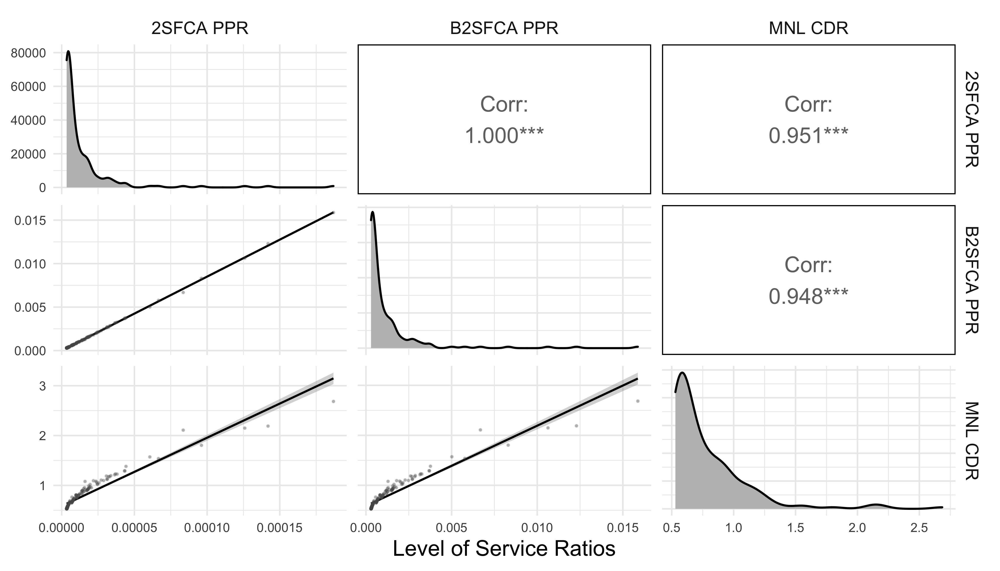
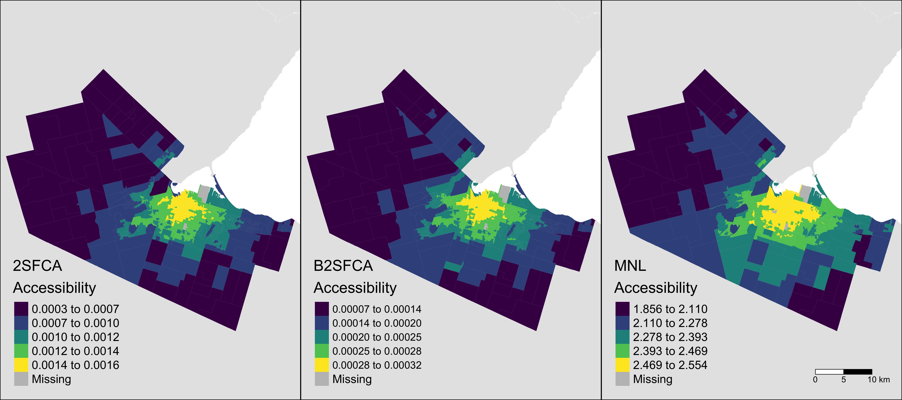
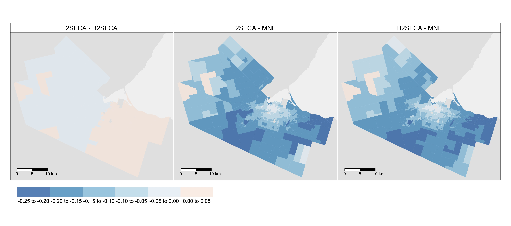
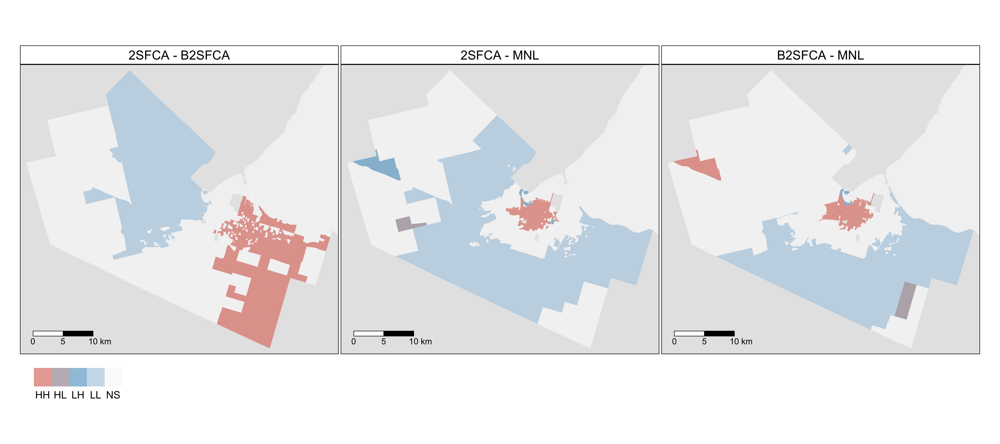
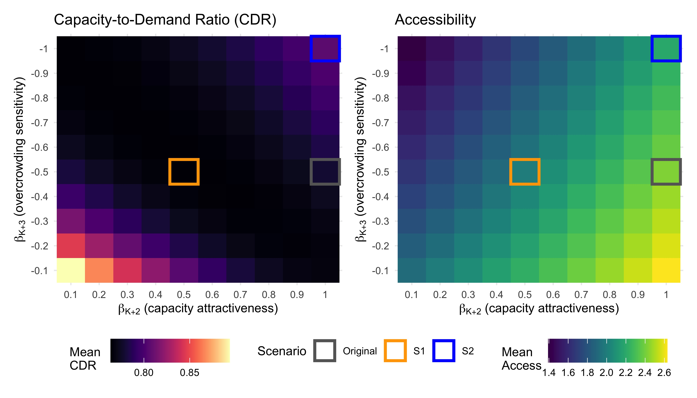

```{r load packages, include = FALSE}
library(GGally)
library(magrittr)
library(sf)
library(spdep)
library(tidyverse)
library(tmap)
library(viridis)
library(patchwork)

# options
tmap_mode("plot")
ggplot2::theme_set(ggplot2::theme_minimal())
knitr::opts_chunk$set(echo = FALSE)
```

```{r clear environment}
rm(list = ls())
```

```{r load results}
load("./results/output_workbook_01.RData")
```

# Introduction

The global COVID-19 pandemic has emphasized the importance of healthcare accessibility, particularly access to primary care physicians, who provide the first point of contact between patients and the healthcare system. In Canada, the Canada Health Act states that all residents should have "reasonable access" to healthcare. However, the 2017 Canadian Community Health Survey revealed that 15.3% of Canadians aged 12 or over did not have a primary care physician, of whom 17.2% stated that there is no physician accessible within their area [@statcan2019].

Accessibility to healthcare services is defined by both spatial and aspatial components [@joseph1982]. Aspatial factors include the cost and quality of healthcare services and the socioeconomic, demographic, and mobility profile of potential users. The second component considers geographic accessibility, which can be defined as the potential to interact with a given set of opportunities, such as healthcare facilities or primary care physicians, from a given location using the transportation network [@hansen1959]. Accessibility to healthcare can therefore be improved through either an increase in the number of available opportunities or through improvements to the transportation network.

In general, four approaches for calculating accessibility exist: infrastructure-based, which focuses on the capacity of transportation infrastructure; location-based, which focuses on spatial distributions of opportunities; person-based, which focuses on accessibility on an individual level; and utility-based, which focuses on the utility derived from interacting with the opportunity or participating in an activity [@geurs2004]. Place-based measures are the most common in the literature and, of these, the family of "floating catchment area" (FCA) methods is one of the most popular for calculating measures of place-based healthcare accessibility that takes the competition for opportunities into account. Because healthcare access is sensitive to demand and supply, Luo and Wang [@luo2003] (drawing on Radke and Mu [-@radke2000]) introduced the Two-step Floating Catchment Area (2SFCA) method that first estimates the demand for healthcare at service locations from population zones and then allocates the level of service back to the population zones using a binary measure of travel impedance.

Since then, various improvements have been made to the 2SFCA approach including adjustments to better capture the friction of distance [@apparicio2017]. The original 2SFCA has also been criticized for over-estimating demand and under-estimating levels of service in the estimation of accessibilities due to the multiple-counting of zonal populations that arises from the overlapping catchments in a study area. In response, researchers have proposed solutions such as the Three-step Floating Catchment Area (3SFCA) [@wan2012], Modified 2SFCA (M2SFCA) [@delamater2013], and Balanced 2SFCA (B2SFCA) [@paez2019] methods. Of these, the B2SFCA is the only approach that preserves the original population and resulting levels of service in calculating floating catchment accessibilities.

However, despite these innovations, FCA methods remain limited in several ways. First, FCA approaches often inflate or deflate demand and supply in the calculation of healthcare access. While the B2SFCA remedies this, it does so by assigning fractions of populations to clinics and service ratios to population zones. Although the parameters of the balanced method sum to the original zonal populations and provider-to-population ratios, this fractional approach does not reflect the ways in which individuals choose to visit facilities. Second, the appeal of any given healthcare facility from the perspective of the population is based solely on its distance or travel time from the origin zone using the transportation network.

In response, this research utilizes a random utility-based formulation for modelling accessibility to healthcare services. Compared to place-based measures of accessibility, utility-based measures of access have a solid grounding in travel behaviour theory [@geurs2004; @miller2018] and allow the analyst to include any information that corresponds to the expected value or attractiveness of travel alternatives as well as characteristics of the individual or household making the trip. While commonly used in alternatives appraisals for transport infrastructure [@dejong2007], utility-based measures of accessibility have not been as widely applied to capture other types of access. However, they appear to be gaining some traction with recent applications considering transit accessibility [@nassir2016], first/last mile access to transit [@hasnine2019], regional accessibility by income class [@jang2020], and accessibility to parks [@macfarlane2020]. To the best of our knowledge, utility-based methods have not yet been applied to the problem of healthcare access. 

In response, this research proposes a utility-based measure of healthcare accessibility based on a multinomial logit (MNL) destination choice model. In contrast to FCA approaches, each patient is, on average, assigned to a single clinic, avoiding the issue of double-counting and inflation/deflation of the demand and levels-of-service respectively in the 2SFCA methods and the assignment of fractional individuals to clinics in the B2SFCA method. Beyond travel time, this specification also allows the analyst to include additional characteristics of the facilities that affect their appeal, such as capacity and competition or crowding at the facility.

To illustrate the potential of the MNL approach, we compare it against the use of the 2SFCA and B2SFCA, both using a continuous decay function. To facilitate open and reproducible research in the spatial sciences [@brunsdon2020; @paez2021], all data and code for this analysis are contained within computational notebooks available at (self-citation; .zip of files for review available anonymously via Google Drive [link]()).

# Methodology

## Floating Catchment Methods

The 2SFCA method, developed by Luo and Wang [-@luo2003], calculates accessibility to healthcare using catchment areas based on a travel time threshold. The first step of this method is calculating the physician- or provider-to-population ratio (PPR), $R_j$, for each clinic at location $j$:

```{=tex}
\begin{equation}
\label{eq:fca_rj}
R_j = \frac{S_j}{\sum_i{P_iW_{ij}}}
\end{equation}
```
<!-- $$
R_j = \frac{S_j}{\sum_i{P_iW_{ij}}}
$$ -->

\noindent where $S_j$ is the number of physicians at clinic $j$ and $P_i$ is the population of zone $i$ weighted by some function of the travel time $W_{ij}$ between zones $i$ and $j$. In the original 2SFCA, Luo and Wang [-@luo2003] utilize a binary impedance function:

```{=tex}
\begin{equation}
\label{eq:fca_W_ij_binary}
W_{ij} = f(t_{ij}) = \left\{
        \begin{array}{ll}
            1 & \quad t_{ij} \leq t_0 \\
            0 & \quad t_{ij} > t_0
        \end{array}
    \right.
\end{equation}
```
<!-- $$
W_{ij} = f(t_{ij}) = \left\{
        \begin{array}{ll}
            1 & \quad t_{ij} \leq t_0 \\
            0 & \quad t_{ij} > t_0
        \end{array}
    \right.
$$ -->

\noindent where the weight equals 1 for populations within the travel time threshold $t_0$ and zero beyond. In their paper, Luo and Wang [-@luo2003] set $t_0 = 15$ minutes. The second step calculates accessibility $A_i$ for the population centres as the sum of the physician-to-population ratios $R_j$ weighted by the impedance function:

```{=tex}
\begin{equation}
\label{eq:fca_A_i}
A_i = \sum_j{R_jW_{ij}}
\end{equation}
```
<!-- $$
A_i = \sum_j{R_jW_{ij}}
$$ -->

While the 2SFCA approach is a special case of a gravity-based accessibility measure, the binary impedance function used by Luo and Wang [-@luo2003] does not consider the effects of competition and travel impedance within a given catchment area. All clinics within a population centre's catchment area are considered equally accessible, regardless of distance, size, wait times, or any other measures of attractiveness. Moreover, all clinics outside of a population centre's catchment area are considered completely inaccessible. To remedy this, Luo and Qi [-@luo2009] propose the Enhanced 2-step Floating Catchment Area (E2SFCA) method that introduces categorical weights for different travel time thresholds to account for travel impedance. Others have improved on the 2SFCA and E2SFCA by using variable catchment sizes [@mcgrail2009], continuous travel time decay functions [@dai2010], and adaptive approaches [@bauer2016] to better reflect travel time costs and the greater appeal of more proximate opportunities.

Researchers have also sought to improve the ways in which supply and demand are modeled in floating catchment approaches. Previous research has shown that both demand and supply can be inflated/deflated in FCA methods [@delamater2013; @paez2019; @wan2012]. This is a consequence of the overlapping floating catchments that cause the populations in zones $i$ to be counted multiple times in the calculation of the provider-to-population ratio $R_j$. These levels-of-service are, in turn, counted multiple times when allocated back to the population zones in the calculation of $A_i$. In practice, the inflation of demand in the first stage of the 2SFCA is generally cancelled out in the second stage when calculating accessibility. However, researchers may be interested in returning more meaningful measures of levels-of-service at the clinics to support the allocation of healthcare resources. In response, Wan et al. [-@wan2012] propose the use of additional Gaussian weights to modify the binary impedance function used by Luo and Wang [-@luo2003]. This results in a steeper impedance function that discounts demand and supply. Corrections have also been made to discount accessibility. Delamater's [-@delamater2013] M2SFCA modifies the second step of the 2SFCA to increase the rate of decay on the level-of-service available to population zones. This is done to address the insensitivity of FCA approaches to the absolute distances required to reach facilities in the calculation of accessibility. The result reflects the increased friction population centres may experience when accessing healthcare facilities in sub-optimally configured urban systems.

However, neither of these approaches fully resolves the issue of demand and supply inflation/deflation. To that end, the B2SFCA approach from Páez et al. [-@paez2019] replaces the impedance functions with row-standardized weights $W_{ij}^{i}$ in the first step:

```{=tex}
\begin{equation}
\label{eq:bfca_R_j}
R_j = \frac{S_j}{\sum_i{P_iW_{ij}^{i}}}
\end{equation}
```
<!-- $$
R_j = \frac{S_j}{\sum_i{P_iW_{ij}^{i}}}
$$  -->

```{=tex}
\begin{equation}
\label{eq:bfca_W_ij_i}
W_{ij}^{i} = \frac{W_{ij}}{\sum_j W_{ij}}
\end{equation}
```
<!-- $$
W_{ij}^{i} = \frac{W_{ij}}{\sum_j W_{ij}}
$$ -->

\noindent and with column-standardized weights $W_{ij}^{j}$ in the second step:

```{=tex}
\begin{equation}
\label{eq:bfca_A_i}
A_i = \sum_j{R_jW_{ij}^{j}}
\end{equation}
```
<!-- $$
A_i = \sum_j{R_jW_{ij}^{j}}
$$  -->

```{=tex}
\begin{equation}
\label{eq:bfca_W_ij_j}
W_{ij}^{j} = \frac{W_{ij}}{\sum_i W_{ij}}
\end{equation}
```
<!-- $$
W_{ij}^{j} = \frac{W_{ij}}{\sum_i W_{ij}}
$$ -->

In this formulation, the travel-time weighted populations sum to the original population values and do not deflate the level-of-service at the clinics. These levels-of-service reflect local PPRs at the clinic level. By extension, the levels-of-service available at the population centres are not inflated through multiple counting. Nevertheless, despite offering balance across both stages of the FCA approach, the B2SFCA also results in fractional apportionment of the population and levels-of-service between the population zones and clinics.

For this research, both the 2SFCA and B2SFCA approaches are specified with a negative exponential impedance function:

```{=tex}
\begin{equation}
\label{eq:W_ij}
W_{ij} = e^{-\beta t_{ij}}
\end{equation}
```
<!-- $$
W_{ij} = e^{-\beta t_{ij}}
$$ -->

\noindent where $\beta$ is a parameter that determines the decay of the function and $t_{ij}$ is the travel time between clinic $j$ and population centre $i$. The $\beta$ parameter is set to 0.05 as this is in the range of typical auto travel time parameters in logit mode choice models calibrated in the Greater Toronto and Hamilton Area [@kasraian2020]. Travel times are calculated based on car travel using a street network from OpenStreetMap and the `r5r` routing tool [@pereira2021].

## Utility-based Method

To address the limitations of existing methods, a novel methodology for deriving utility-based accessibility is developed which assigns trips from households in population centres to clinics. The general form of this function is as follows:

```{=tex}
\begin{equation}
\label{eq:mnl_T_ij}
T_{ij} = f(H_i, Z_j, D_j, t_{ij}, \beta)
\end{equation}
```
<!-- $$
T_{ij} = f(H_i, Z_j, D_j, t_{ij}, \beta)
$$ -->

\noindent where:

-   $T_{ij}$ is the number of trips from zone $i$ to clinic $j$
-   $H_i$ is the number of households in zone $i$
-   $Z_j$ is the number of doctors at clinic $j$
-   $D_j$ is the demand-to-capacity ratio at clinic $j$ (note this is inverted from the physician-to-population ratios used in previous FCA approaches)
-   $t_{ij}$ is the travel time between zones $i$ and $j$, and $\beta$ is a row vector of parameters to be estimated.

To estimate these parameters, information minimization is used as this approach allows for the least-biased parameter estimation and has been proven to be identical to utility maximization [@anas1983]. Based on information minimization theory, the probability that a household in zone $i$ will visit clinic $j$ can be estimated as follows:

```{=tex}
\begin{equation}
\label{eq:mnl_MAX_T_ij}
MAX_{T_{ij}} E = -\sum_{j \in J} \sum_{i \in I} T_{ij} log(T_{ij})
\end{equation}
```
<!-- $$
MAX_{T_{ij}} E = -\sum_{j \in J} \sum_{i \in I} T_{ij} log(T_{ij})
$$ -->

\noindent subject to the following constraints:

```{=tex}
\begin{equation}
\label{eq:mnl_constraint1}
\sum_{j \in J}T_{ij} = \alpha H_i \forall i \in I
\end{equation}
```
```{=tex}
\begin{equation}
\label{eq:mnl_constraint2}
\sum_{i \in I} \sum_{j \in J} T_{ij} t_{ij} = \bar{t}T
\end{equation}
```
```{=tex}
\begin{equation}
\label{eq:mnl_constraint3}
\sum_{i \in I} \sum_{j \in J} T_{ij} log(C_j) = \sum_{i \in I} \sum_{j \in J}T_{ij} log \omega Z_j = \bar{C}T
\end{equation}
```
```{=tex}
\begin{equation}
\label{eq:mnl_constraint4}
\sum_{i \in I} \sum_{j \in J} T_{ij} D_j = \bar{D}T
\end{equation}
```
<!-- $$
\sum_{j \in J}T_{ij} = \alpha H_i \forall i \in I 
$$ -->
<!-- $$
\sum_{i \in I} \sum_{j \in J} T_{ij} t_{ij} = \bar{t}T 
$$ -->
<!-- $$
\sum_{i \in I} \sum_{j \in J} T_{ij} log(C_j) = \sum_{i \in I} \sum_{j \in J}T_{ij} log \omega Z_j = \bar{C}T 
$$ -->
<!-- $$
\sum_{i \in I} \sum_{j \in J} T_{ij} D_j = \bar{D}T
$$ -->

\noindent where:

-   $I$ is the set of all residential zones
-   $J$ is the set of all clinics
-   $\alpha$ is the average number of visits to the doctor per household
-   $\bar{t}$ is the average observed travel time for home-based trips to clinics
-   $T$ is the total number of daily trips to clinics
-   $C_j$ is the nominal service capacity at clinic $j$
-   $\omega$ is the average number of patients served by a doctor per day
-   $\bar{C}$ is the average observed nominal service capacity
-   $\bar{D}$ is the average observed demand-to-capacity ratio
-   $H$ is the total number of households
-   $Z$ is the total number of primary care physicians

The service capacities and demand-to-capacity ratios are calculated as follows:

```{=tex}
\begin{equation}
\label{eq:mnl_C_j}
C_j = \omega Z_j
\end{equation}
```
<!-- $$
C_j = \omega Z_j
$$  -->
```{=tex}
\begin{equation}
\label{eq:mnl_D_j}
D_j = \frac{\sum_{i \in I} T_{ij}}{C_j} = \frac{\sum_{i \in I} T_{ij}}{\omega Z_j}
\end{equation}
```
<!-- $$
D_j = \frac{\sum_{i \in I} T_{ij}}{C_j} = \frac{\sum_{i \in I} T_{ij}}{\omega Z_j}
$$ -->

\noindent Solving this set of equations yields the following:

```{=tex}
\begin{equation}
\label{eq:mnl_T_ij_specific}
T_{ij} = \alpha H_i Pr_{ij}
\end{equation}
```
<!-- $$
T_{ij} = \alpha H_i Pr_{ij}
$$ -->

\noindent This is a singly-constrained gravity model where the probability that a household in zone $i$ will visit clinic $j$ is as follows:

```{=tex}
\begin{equation}
\label{eq:mnl_Pr}
Pr_{ij} = \frac{e^{\beta_1 t_{ij} + \beta_{K+2} log \omega Z_j + \beta_{K + 3} D_j}}{\sum_j\prime e^{\beta_1 t_{ij}\prime + \beta_{K+2} log \omega Z_j\prime + \beta_{K + 3} D_j\prime}}
\end{equation}
```
<!-- $$
Pr_{ij} = \frac{e^{\beta_1 t_{ij} + \beta_{K+2} log \omega Z_j + \beta_{K + 3} D_j}}{\sum_j\prime e^{\beta_1 t_{ij}\prime + \beta_{K+2} log \omega Z_j\prime + \beta_{K + 3} D_j\prime}}
$$ -->

Ideally, the three $\beta$ parameters would be estimated iteratively in order to meet the outlined constraints. However, due to a lack of observed data on trips to doctors in the study area, these parameters are instead chosen based on the following considerations:

-   The $\beta_1$ travel time impedance parameter is set to -0.05 to align with the choice model rationale outlined in the 2SFCA and B2SFCA approaches above.
-   Random utility theory requires the $\beta_{K+2}$ capacity attractiveness parameter to lie between 0 to 1 in value. It is set equal to 1 in this case to maximize the attractiveness of larger clinics with more physicians.
-   No theory is currently available to guide the choice of the $\beta_{K+3}$ parameter that influences sensitivity to overcrowding when trip demand exceeds the capacity to see patients at a clinic. In this case, -0.5 is chosen as a "first guess" value that would produce a reasonable sensitivity to clinic over-crowding, but not prevent over-crowding from occurring.

These values ensure that increased travel times and demand-to-capacity ratios reduce the probability that a household in zone $i$ will visit clinic $j$, while increased capacity at clinic $j$ increases the probability. Since $D_j$ is a function of $T_{ij}$ and vice-versa, an iterative approach is taken to estimate the $D_j$ values. The multinomial logit destination choice model ensures that demand at clinics is not over-estimated, as each patient on average is assigned to a single clinic and is not double counted, as occurs in the 2SFCA method. The end result is an approach that involves location choice modelling by maximizing utility for patients, with clinics with higher demand and longer travel times attracting fewer trips while larger clinics that are uncongested and those closer to the origins attract more trips.

## Utility-based Accessibility

While the probability of visiting a particular clinic is based on its utility relative to the utility of others available within the choice set, following Ben-Akiva and Lerman [-@ben1985], the expected maximum utility from all destination choices available to a household can be understood as a random utility theory-based measure of accessibility. For the multinomial logit (MNL) model, it can be shown that this is the logarithm of the denominator in Equation \ref{eq:mnl_Pr} (the so-called "logsum" or "inclusive value" term), yielding for this model the following accessibility measure:

```{=tex}
\begin{equation}
\label{eq:mnl_logsum}
A_i = log(\sum_{j\prime} e^{\beta_1 t_{ij}\prime + \beta_{K+2} log \omega Z_j\prime + \beta_{K + 3} D_j\prime})
\end{equation}
```
<!-- $$
A_i = log(\sum_{j\prime} e^{\beta_1 t_{ij}\prime + \beta_{K+2} log \omega Z_j\prime + \beta_{K + 3} D_j\prime})
$$ -->

\noindent where accessibility is based not only on the utility of the clinic with the greatest probability of visitation, but the utility of all clinics available to a household considering travel impedance, clinic size and capacity, trip-based demand for primary care physicians, and congestion or crowding.

# Study Area

The study area for this research is the City of Hamilton in Ontario, Canada. Based on data from the 2016 Canadian Census of Population, the population of Hamilton is `r prettyNum(data_da_2016_poly %>% st_drop_geometry() %>% summarize(sum(Population)) %>% pull(), big.mark = ",")` living in `r prettyNum(data_da_2016_poly %>% st_drop_geometry() %>% summarize(sum(Households)) %>% pull(), big.mark = ",")` households. The left panel of Figure \ref{fig:study_area_map} plots population densities in the Dissemination Areas (DAs) in the City of Hamilton, highlighting that the higher-density urban core is surrounded by lower-density suburbs that extend into land that is largely rural in character. DAs are the smallest geographic unit for which socioeconomic and demographic census data are publicly available.

Information on the count and location of primary care physicians was obtained using the College of Physicians and Surgeons of Ontario's online registration database. Clinic locations were geocoded based on their address and records were aggregated to count the number of physicians practicing at each unique location. The data for this paper have been used previously by Páez et al. [-@paez2019], although in this case we consider only clinics that are within the spatial extent of the City of Hamilton. While this does introduce edge effects in the calculation of accessibility, limiting the study extent to a closed system permits calculation of the multinomial logit model's congestion effects and utility-based accessibilities. In total, there are `r prettyNum(doctors %>% st_drop_geometry() %>% summarize(sum(doctor_count)) %>% pull(), big.mark = ",")` primary care physicians available at clinics in the City of Hamilton in our data. Note that this is not strictly the number of physicians, as some physicians offer services at more than one clinic. Rather, it reflects the availability of physicians at given locations. The right panel of Figure \ref{fig:study_area_map} plots the location and total number of available physicians at the clinic locations. This total produces a city-wide average physician-to-population ratio of `r round((doctors %>% st_drop_geometry() %>% summarize(sum(doctor_count)) %>% pull())/(data_da_2016_poly %>% st_drop_geometry() %>% summarize(sum(Population)/100000) %>% pull()), 2)` primary care doctors available per 100,000 people.

Populating the MNL model requires the specification of several parameters related to the study area. In order to ensure that the average observed demand-to-capacity ratio $\bar{D}$ is approximately equal to 1, the $\alpha$ and $\omega$ parameters are assumed to be 22 patients seen by a doctor per day and 0.065 visits to the doctor per household per day respectively. The patients per day number is derived from the Canadian Institute for Health Information who reports that the median number of patients seen by primary care physicians during a typical work week in Ontario was 100 in 2019 [@cihi2020]. At an assumed 20 patients per day over a 5-day work week and 50 weeks in a typical year after holidays, this results in an estimated patient capacity of approximately `r round((100*50*631)/1000000, 1)` million patients per year across the 631 primary care physicians in the data, or `r round((100*50*631)/ data_da_2016_poly %>% st_drop_geometry() %>% summarize(sum(Population)) %>% pull(), 1)` visits per person per year. On the other hand, Vogel [-@vogel2017] reports a Canada-wide average of 7.6 visits per person per year in 2016, which would result in demand for approximately `r round((7.6 * data_da_2016_poly %>% st_drop_geometry() %>% summarize(sum(Population)) %>% pull())/1000000, 1)` million visits per year from the population residing in the City of Hamilton. 

Taking into consideration that Hamilton is part of the larger Greater Golden Horseshoe region, meaning not all trips and visits are bounded by the study area and that there are uncertainties surrounding the estimated visits per year and physician practices, we slightly increased the CIHI's number of patients seen per physician per week from 100 to 110. This corresponds to 22 visits per day and a capacity of `r round((110*50*631)/ data_da_2016_poly %>% st_drop_geometry() %>% summarize(sum(Population)) %>% pull(), 2)` visits per person per year. Based on our assumption of $\alpha = 22$, this results in a total capacity of `r prettyNum(doctors %>% st_drop_geometry() %>% summarize(sum(doctor_count)*22) %>% pull(), big.mark = ",")` patient visits per day in the MNL model formulation. Dividing the total estimated number of daily trips by the number of households yields a household trip generation rate of approximately 0.065 trips per household per day for `r prettyNum(data_da_2016_poly %>% st_drop_geometry() %>% summarize(sum(Households)*0.065) %>% pull(), big.mark = ",")` trips to the doctor entering the MNL model.  

```{r prepare study_area_map, include = FALSE}
pop_dens_map <- tm_shape(ontario_poly, bbox = st_bbox(data_da_2016_poly)) + 
  tm_fill("grey90") +
  tm_shape(data_da_2016_poly) + 
  tm_fill(col = "popdens", palette = "viridis", style = "jenks", title = "Population per HA")  +
  tm_layout(legend.position = c("left","bottom")) #+tm_layout(inner.margins = c(0,0,0,0))

doctors_map <- tm_shape(ontario_poly, bbox = st_bbox(data_da_2016_poly)) + 
  tm_fill("grey90") +
  tm_shape(data_da_2016_poly) + 
  tm_fill("grey75") +
  tm_shape(doctors) + 
  tm_bubbles(size = "doctor_count", 
             col = "doctor_count", 
             palette = "viridis", 
             style = "jenks", 
             title.size = "Family Physicians", 
             title.col = "") +
  tm_layout(legend.position = c("left","bottom")) + #+tm_layout(inner.margins = c(0,0,0,0)) 
  tm_scale_bar(lwd = 0.5, breaks = c(0, 5, 10))

study_area_map <- tmap_arrange(pop_dens_map, doctors_map, nrow = 1, outer.margins = c(0, 0, 0, 0))
tmap_save(study_area_map, filename = "./img/study_area_map.jpg", dpi = 600, width = 9, height = 4.5)
```

```{r fig 1 study_area_map, fig.cap="\\label{fig:study_area_map}Population Density and Physician Locations", out.width = '100%'}

```

# Results

## Demand and Clinic Level of Service

To compare the three methods, we focus first on the results associated with how each of the methods calculates demand and levels of service at the clinic locations. The level of service for the FCA approaches is the local provider-to-population ratio (PPR) for each clinic while the MNL model calculates trip demand-to-patient capacity ratios (DCR). To make this comparable, we first take the inverse of the MNL ratios to reflect patient capacity-to-trip demand ratio (CDR). Figure \ref{fig:ppr_dist} displays a pair plot of the density of each level-of-service statistic and their relationship and correlations with one another. The plot highlights how the 2SFCA and B2SFCA methods are fundamentally similar in the ways in which they allocate demand to the clinics with only a few clinics above or below the scatterplot trend line. Likewise, it is interesting to note the relatively high correlations between the PPRs at the clinics in the FCA methods and the capacity-to-demand ratios in the MNL model with the scatterplot revealing some non-linearity in this relationship across the methods.

```{r prepare pair plots, message = FALSE, warning = FALSE}
# lower triangle custom function
lowerfun <- function(data,mapping){
  ggplot(data = data, mapping = mapping) +
    geom_smooth(method='lm', formula= y~x, colour="black", size = .5) +
    geom_point(alpha = 0.3, size = 0.2, color = "gray35") +
  theme_minimal(base_size = 8)}

# diagonal element custom function
diagfun <- function(data, mapping) {
  ggplot(data = data, mapping=mapping) +
    geom_density(fill = "gray") +
  theme_minimal(base_size = 8)}

# calculate capacity-to-demand ratio for MNL results
doctors %<>% mutate(mnl_cdr = 1/mnl_dcr)

pair_plot_ppr <- ggpairs(doctors %>% st_drop_geometry() %>% drop_na(), 
        columns = c("fca_ppr", "bfca_ppr", "mnl_cdr"), xlab = "Level of Service Ratios", 
        diag = list(continuous = wrap(diagfun)),
        lower = list(continuous = wrap(lowerfun)),
        columnLabels = c("2SFCA PPR", "B2SFCA PPR", "MNL CDR"))

pair_plot_access <- ggpairs(data_da_2016_poly %>% st_drop_geometry() %>% drop_na(), 
        columns = 12:14, xlab = "Accessibility", 
        diag = list(continuous = wrap(diagfun)),
        lower = list(continuous = wrap(lowerfun)),
        columnLabels = c("2SFCA", "B2SFCA", "MNL")) 

# save
ggsave(pair_plot_ppr, filename = "./img/pair_plot_ppr.jpg", device = "jpeg", dpi = 600, height = 4, width = 7)
ggsave(pair_plot_access, filename = "./img/pair_plot_access.jpg", device = "jpeg", dpi = 600, height = 4, width = 7)
```

```{r fig 2 ppr_dist_fig, fig.cap="\\label{fig:ppr_dist}Comparing Level of Service Distributions (Clinics)", out.width = '100%'}

```

Figure \ref{fig:los_maps} displays the levels of service for the clinic locations. In general, more urban clinics tend to exhibit higher levels of demand and lower levels of service across all three models. However, the PPR values for the individual clinics in the 2SFCA are extremely small compared to results from the B2SFCA model, highlighting how the original method's multiple counting tends to inflate the (travel time weighted) population numbers in each clinic's catchment and deflate the level of service available at the clinics. In contrast, the PPRs in the B2SFCA method are readily interpretable as the local ratio of doctors per person for a given clinic considering the (travel-time weighted and apportioned) populations within its catchment. Similarly, the MNL CDRs reflect the relationship between trip demand and patient capacity based on the assumed rates. In terms of spatial trends, results from the 2SFCA and MNL models suggest both calculate higher levels of service at larger clinics in the urban core as well as at a larger clinic in the city's rural north-west. In contrast, the B2SFCA method generally produces higher levels of service in an east-to-west direction. This could reflect boundary effects in the study area that omit the large populations present in the rest of the Greater Toronto Area on the northern side of Lake Ontario that may also have access to these clinics by driving.

```{r prepare los_maps, include = FALSE}
los_map_fca <- tm_shape(ontario_poly, bbox = st_bbox(data_da_2016_poly)) + 
  tm_fill("grey90") +
  tm_shape(data_da_2016_poly) + 
  tm_fill("grey75") +
  tm_shape(doctors) + 
  tm_bubbles(size = "fca_ppr", 
             scale = .6,
             #n = 4,
             col = "fca_ppr", 
             palette = "viridis", 
             style = "jenks", 
             title.size = "2SFCA PPR", 
             title.col = "") +
  tm_layout(legend.position = c("left","bottom"))

los_map_bfca <- tm_shape(ontario_poly, bbox = st_bbox(data_da_2016_poly)) + 
  tm_fill("grey90") +
  tm_shape(data_da_2016_poly) + 
  tm_fill("grey75") +
  tm_shape(doctors) + 
  tm_bubbles(size = "bfca_ppr", 
             scale = .6,
             #n = 4,
             col = "bfca_ppr", 
             palette = "viridis", 
             style = "jenks", 
             title.size = "B2SFCA PPR", 
             title.col = "") +
  tm_layout(legend.position = c("left","bottom"))

los_map_mnl <- tm_shape(ontario_poly, bbox = st_bbox(data_da_2016_poly)) + 
  tm_fill("grey90") +
  tm_shape(data_da_2016_poly) + 
  tm_fill("grey75") +
  tm_shape(doctors) + 
  tm_bubbles(size = "mnl_cdr", 
             scale = .6,
             #n = 4,
             col = "mnl_cdr", 
             palette = "viridis", 
             style = "jenks", 
             title.size = "MNL CDR", 
             title.col = "") +
  tm_layout(legend.position = c("left","bottom")) + 
  tm_scale_bar(lwd = 0.5, breaks = c(0, 5, 10))

los_maps <- tmap_arrange(los_map_fca, los_map_bfca, los_map_mnl, nrow = 1, outer.margins = c(0, 0, 0, 0))
tmap_save(los_maps, filename = "./img/los_maps.jpg", dpi = 600, width = 9, height = 4)
```

```{r fig 3 los_maps_fig, fig.cap="\\label{fig:los_maps}Mapping Levels of Service (Clinics)", out.width = '100%'}

```

## Healthcare Accessibility

With the levels of service calculated above, the three models then calculate accessibility to healthcare services in Hamilton. Distributions, relationships, and correlations for the accessibility results are shown in Figure \ref{fig:access_dist}. In this case, all three models are highly correlated. The 2SFCA and B2SFCA produce nearly identical distributions of results. As above, their main difference is in the scaling of parameters. In the 2SFCA, accessibilities can be interpreted relative to the city-wide average provider-to-population ratio of `r round((doctors %>% st_drop_geometry() %>% summarize(sum(doctor_count)) %>% pull())/(data_da_2016_poly %>% st_drop_geometry() %>% summarize(sum(Population)) %>% pull()), 4)` doctors per person. In the case of the balanced method, the accessibilities correspond to the sum of travel time weighted and apportioned provider-to-population ratios available in the population zones free of the inflation and deflation that occurs in the 2SFCA. In contrast, the scatterplots of the MNL results again highlight some non-linearity in the way the utility-based accessibilities are calculated compared to the FCA methods. The thinner tail of the MNL distribution suggests the method also results in fewer population zones with lower accessibility compared to the FCA methods.

```{r fig 4 access_dist_fig, fig.cap="\\label{fig:access_dist}Comparing Accessibility Distributions (DAs)", out.width = '100%'}

```

The general spatial trends are similar across all three models (Figure \ref{fig:access_maps}). The absolute accessibility values differ in accordance with the ways each method calculates its accessibility results. The FCA methods define accessibility based on the physician-to-population ratios of clinics, resulting in smaller values. In contrast, the MNL method defines accessibilities as the logsum of the denominator of the multinomial logit model, resulting in larger values that have no direct physical interpretation. In general, the highest accessibilities to primary care physicians correspond to the downtown area of Hamilton, where a large number of clinics are concentrated. Accessibility to physicians generally decreases with increased distance from the downtown area.

```{r access_maps, include = FALSE}
access_map_fca <- tm_shape(ontario_poly, bbox = st_bbox(data_da_2016_poly)) + 
  tm_fill("grey90") +
  tm_shape(data_da_2016_poly) + 
  tm_fill(col = "fca_access", palette = "viridis", style = "jenks", title = "2SFCA\nAccessibility")  +
  tm_layout(legend.position = c("left","bottom"))

access_map_bfca <- tm_shape(ontario_poly, bbox = st_bbox(data_da_2016_poly)) + 
  tm_fill("grey90") +
  tm_shape(data_da_2016_poly) + 
  tm_fill(col = "bfca_access", palette = "viridis", style = "jenks", title = "B2SFCA\nAccessibility")  +
  tm_layout(legend.position = c("left","bottom"))

access_map_mnl <- tm_shape(ontario_poly, bbox = st_bbox(data_da_2016_poly)) + 
  tm_fill("grey90") +
  tm_shape(data_da_2016_poly) + 
  tm_fill(col = "mnl_access", palette = "viridis", style = "jenks", title = "MNL\nAccessibility")  +
  tm_layout(legend.position = c("left","bottom")) + 
  tm_scale_bar(lwd = 0.5, breaks = c(0, 5, 10))

access_maps <- tmap_arrange(access_map_fca, access_map_bfca, access_map_mnl, nrow = 1, outer.margins = c(0, 0, 0, 0))
tmap_save(access_maps, filename = "./img/access_maps.jpg", dpi = 600, width = 9, height = 4)
```

```{r fig 5 access_maps, fig.cap="\\label{fig:access_maps}Mapping Accessibility Results (DAs)", out.width = '100%'}

```

To better highlight significant differences in the spatial patterns of accessibility produced by each method, Figure \ref{fig:access_diff_maps} displays the absolute differences in normalized accessibilities across models. To make the values comparable, we first normalize each accessibility vector between 0-1 and take the differences of the normalized values across each approach. In general, the MNL method tends to produce higher accessibilities for most zones compared to the FCA methods. In line with the distributions above, the 2SFCA and B2SFCA models appear to be most similar, with only slight absolute differences in the calculated accessibility values. Nevertheless, paired Wilcoxon Rank Sum tests across all three types of normalized accessibilities are statistically significant at $p=0.05$, suggesting that while the accessibility results are highly correlated, their distributions are significantly different.

```{r define local moran functions}
# create local moran classifier function
local_moran_classifier <- function(input_var, p_value, w_matrix){
  s_var = as.vector(scale(input_var))
  w_var = lag.listw(w_matrix, var = s_var)
  classified = ifelse(s_var > 0 & w_var > 0 & p_value <=0.05, "HH",
                       ifelse(s_var <= 0 & w_var <= 0 & p_value <=0.05, "LL",
                              ifelse(s_var > 0 & w_var <= 0 & p_value <=0.05, "HL",
                                     ifelse(s_var <= 0 & w_var > 0 & p_value <=0.05, "LH",
                                            "NS"))))
  return(classified) 
}

# local moran classification colour palette
locm_palette <- c("#E08C80", "#7BB0D2", "#F9F9F9")

# normalize function
norm_x <- function(x){
  n_x = (x - min(x, na.rm = TRUE))/(max(x, na.rm = TRUE) - min(x, na.rm = TRUE))
  return(n_x)
}
```

```{r}
# prepare data by taking differences
da_poly <- data_da_2016_poly %>% 
  select(GeoUID, fca_access, bfca_access, mnl_access, geometry) %>% 
  drop_na(mnl_access) %>%
  mutate(n_fca_access = norm_x(fca_access),
         n_bfca_access = norm_x(bfca_access),
         n_mnl_access = norm_x(mnl_access),
         diff_fca_bfca = n_fca_access - n_bfca_access,
         diff_fca_mnl = n_fca_access - n_mnl_access,
         diff_bfca_mnl = n_bfca_access - n_mnl_access)

diff_list <- c("diff_fca_bfca", "diff_fca_mnl", "diff_bfca_mnl")

# get spatial weights
da_poly_queen <- poly2nb(pl = da_poly, queen=TRUE)
da_poly_queen_W <- nb2listw(neighbours = da_poly_queen, style = "W")
```

```{r moran classification}
# get local moran's I p-values
lmpv_list <- list()
for (i in diff_list){
  local_m <- as.data.frame(localmoran(x = da_poly[[i]], listw = da_poly_queen_W))
  # create new variable name for p value and rename
  pv_varname = paste0("lmpv_", i)
  local_m <- local_m %>% rename(!!pv_varname := starts_with("Pr")) %>% select(!!pv_varname)
  lmpv_list[[i]] <- local_m}

# cbind to the original da polys
da_poly %<>% cbind(bind_cols(lmpv_list))

# classify p values
lm_class_list <- list()
for (i in diff_list){
  #input_varname = 
  pv_varname = paste0("lmpv_", i)
  out_varname <- paste0("lmc_", i)
  lm_class <- da_poly %>% 
    st_drop_geometry() %>% 
    mutate(!!out_varname := local_moran_classifier(.data[[i]], get(pv_varname), da_poly_queen_W))
  lm_class_list[[i]] <- lm_class %>% select(!!out_varname)
}

# cbind to the original da polys
da_poly %<>% cbind(bind_cols(lm_class_list)) 
```

```{r access diff maps, include = FALSE}
# convert to long format
da_poly_diff_long <- da_poly %>%
  pivot_longer(starts_with("diff"), names_to = "name", values_to = "values") %>% 
  mutate(name = fct_relevel(name, "diff_fca_bfca", "diff_fca_mnl", "diff_bfca_mnl")) %>%
  st_sf()
                
access_diff_maps <- tm_shape(ontario_poly, bbox = st_bbox(data_da_2016_poly)) + 
  tm_fill("grey90") +
  tm_shape(da_poly_diff_long) +
  tm_fill(col = "values", 
          alpha = .75, 
          #style = 'fixed', 
          #breaks = div_breaks, 
          palette = "-RdBu",
          midpoint = 0,
          title = "", #"Accessibility Difference Hot Spots",
          legend.is.portrait=FALSE) +
  tm_facets("name", nrow = 1) +
  tm_layout(bg.color = "grey95", 
            legend.outside = TRUE,
            legend.outside.position = c("bottom"),
            legend.outside.size = .1,
            #legend.position = c(0.01, 1),
            #legend.stack = "horizontal",
            between.margin = 0.1,
            panel.labels = c("2SFCA - B2SFCA", "2SFCA - MNL", "B2SFCA - MNL"),
            panel.label.bg.color = NA,
            panel.label.size = .75) + 
  tm_scale_bar(position = c(0.03, 0.01), lwd = 0.5, breaks = c(0, 5, 10))

tmap_save(access_diff_maps, filename = "./img/access_diff_maps.jpg", dpi = 600, width = 9, height = 4)
```

```{r fig 6 access_diff_maps, fig.cap="\\label{fig:access_diff_maps}Normalized Accessibility Differences", out.width = '100%'}

```

```{r t_tests, include = FALSE}
# reviewer 3 t and wilcoxon tests - raw data
t.test(da_poly$fca_access, da_poly$bfca_access, paired = TRUE)
t.test(da_poly$fca_access, da_poly$mnl_access, paired = TRUE)
t.test(da_poly$bfca_access, da_poly$mnl_access, paired = TRUE)
wilcox.test(da_poly$fca_access, da_poly$bfca_access, paired = TRUE)
wilcox.test(da_poly$fca_access, da_poly$mnl_access, paired = TRUE)
wilcox.test(da_poly$bfca_access, da_poly$mnl_access, paired = TRUE)

# reviewer 3 t and wilcoxon tests - normalized data
t.test(da_poly$n_fca_access, da_poly$n_bfca_access, paired = TRUE)
t.test(da_poly$n_fca_access, da_poly$n_mnl_access, paired = TRUE)
t.test(da_poly$n_bfca_access, da_poly$n_mnl_access, paired = TRUE)
wilcox.test(da_poly$n_fca_access, da_poly$n_bfca_access, paired = TRUE)
wilcox.test(da_poly$n_fca_access, da_poly$n_mnl_access, paired = TRUE)
wilcox.test(da_poly$n_bfca_access, da_poly$n_mnl_access, paired = TRUE)
```

To examine whether there are any spatial patterns in these differences, Figure \ref{fig:access_locm_maps} plots the results of Local Moran's I tests. The Local Moran's I is calculated on the differences using queen-style contiguity weights, a critical significance level of $p=0.05$, and without correcting for multiple testing. The resulting maps reveal some interesting patterns of spatial clustering in the calculated normalized differences, particularly across the two FCA models compared to the MNL model. Here, differences in accessibility are greatest between the FCA and MNL methods in the low-low (LL) cluster in the ring of outer suburbs that surround the city where the MNL model tends to estimate higher accessibilities. In contrast, the calculated accessibilities are more consistent across the methods in the high-high (HH) cluster in the central part of the city. Differences in the remaining zones are generally not significant (NS) aside from a very small number of high-low (HL) and low-high (LH) outliers.

This overall pattern is likely due to the way the MNL approach handles clinic choices and accessibilities. Higher accessibilities in the urban core are generally due to populations having access to a larger number of clinics that are closer, have higher capacities, and are less congested. The iterative trip-based calculations in the MNL model should also result in fewer individuals from more urban locations competing for healthcare resources at more suburban and rural clinics, leading to higher accessibilities in these areas relative to the other methods. In contrast, the FCA methods allocate populations to all clinics within their catchment area using weights derived from the impedance function. While this produces a smoothing of the accessibilities, it can result in lower levels of service and accessibility for clinics that populations may not actually use. This effect seems to be minimized in more urban locations featuring higher population densities and a greater number of clinics with available physicians. Comparing the normalized results from the 2SFCA and the B2SFCA models, the patterns of spatial clustering in the differences appears to be less associated with the city's urban-suburban-rural urban structure. While the B2SFCA method generally calculates slightly higher accessibilities across the western half of the city, the 2SFCA produces slightly higher accessibilities in the east.

```{r local moran maps, include = FALSE}
da_poly_lmc_long <- da_poly %>%
  pivot_longer(starts_with("lmc"), names_to = "name", values_to = "values") %>% 
  mutate(name = fct_relevel(name, "lmc_diff_fca_bfca", "lmc_diff_fca_mnl", "lmc_diff_bfca_mnl")) %>%
  st_sf()

access_locm_maps <- tm_shape(ontario_poly, bbox = st_bbox(data_da_2016_poly)) + 
  tm_fill("grey90") +
  tm_shape(da_poly_lmc_long) +
  tm_fill(col = "values", 
          alpha = .75, 
          #style = 'fixed', 
          #breaks = div_breaks, 
          palette = locm_palette, 
          title = "", #"Accessibility Difference Hot Spots",
          legend.is.portrait=FALSE) +
  tm_facets("name", nrow = 1) +
  tm_layout(bg.color = "grey95", 
            legend.outside = TRUE,
            legend.outside.position = c("bottom"),
            legend.outside.size = .1,
            #legend.position = c(0.01, 1),
            #legend.stack = "horizontal",
            between.margin = 0.1,
            panel.labels = c("2SFCA - B2SFCA", "2SFCA - MNL", "B2SFCA - MNL"),
            panel.label.bg.color = NA,
            panel.label.size = .75) + 
  tm_scale_bar(position = c(0.03, 0.01), lwd = 0.5, breaks = c(0, 5, 10))

tmap_save(access_locm_maps, filename = "./img/access_locm_maps.jpg", dpi = 600, width = 9, height = 4)
```

```{r fig 7 access_locm_maps, fig.cap="\\label{fig:access_locm_maps}Accessibility Difference Hot Spots", out.width = '100%'}

```

## MNL Model Sensitivity Analysis

In order to assess the impact of the asserted $\beta_{K+2}$ and $\beta_{K+3}$ parameters on the results generated by the MNL method, a sensitivity analysis was undertaken. The $\beta_{K+2}$ parameter that influences the attractiveness of higher-capacity clinics was gradually increased from 0.1 to 1 and the $\beta_{K + 3}$ parameter that influences sensitivity to congestion or crowding at the clinics was gradually increased from -1 to -0.1. Increments of 0.1 are used for each variable. Results are summarized by calculating average CDRs and accessibilities across the clinics and DAs respectively in each of the 100 scenarios (Figure \ref{fig:sensitivity_plot}). Two example scenarios are also created for illustration. In Scenario 1, the $\beta_{K+2}$ parameter was decreased from 1 to 0.5 relative to the original calculations while the $\beta_{K + 3}$ parameter was decreased from -0.5 to -1 in Scenario 2 (increasing the sensitivity to overcrowding).

For the CDRs in the left panel of Figure \ref{fig:sensitivity_plot}, the sensitivity analysis reveals that decreasing sensitivity to the attractiveness of capacity (as $\beta_{K+2}$ approaches 0.1) and decreasing sensitivity to overcrowding (as $\beta_{K+3}$ approaches -0.1) combine to produce more balance between the supply of physician capacities and patient demand, on average. Examining the clinic data in greater detail, this weighting results in more trips being made to smaller and more congested clinics relative to larger ones where there is more supply relative to demand. Greater weight placed on facility capacity (as $\beta_{K+2}$ approaches 1) and high sensitivity to overcrowding (as $\beta_{K+3}$ approaches -1) also results in more balanced CDRs, but in this case, more trips are made to larger clinics that become more congested versus smaller ones that are less congested. Scenarios along the diagonal exhibit relatively less balance, on average, across the clinics.

In terms of accessibilities, average accessibilities are, in general, more sensitive to changes in the $\beta_{K+2}$ parameter than $\beta_{K+3}$. Comparing the original results against Scenario 1, average accessibilities increase by around 22% when $\beta_{K+2}$ increases from 0.5 to 1. In contrast, accessibilities in the original scenario are about 11% greater than those calculated from Scenario 2 where the $\beta_{K+3}$ sensitivity to overcrowding parameter increases in weight from -0.5 to -1. The greatest average accessibilities in Figure \ref{fig:sensitivity_plot} result from high attractiveness to clinic capacity and low weight on overcrowding ($\beta_{K+2} = 1$ and $\beta_{K+3} = -0.1$). This produces high levels of average access as households benefit from the overall availability of large clinics accessible by car despite the greater levels of congestion that occur at smaller clinics.

To examine whether the sensitivity analysis impacts the spatial distributions of calculated accessibilities, Figure \ref{fig:sensitivity_maps} plots normalized accessibility results from the original and two sensitivity scenarios. Although both adjustments to the parameters result in decreased absolute accessibilities in Figure \ref{fig:sensitivity_plot}, comparisons of normalized values suggest there are no distinct spatial trends associated with changes in $\beta_{K + 2}$ and $\beta_{K + 3}$ across the sensitivity scenarios. Overall, both Figures \ref{fig:sensitivity_plot} and \ref{fig:sensitivity_maps} indicate that the MNL results are relatively robust with respect to the parameter value assumptions. CDR average values are relatively constant across wide combinations of parameter values (except at the extremes of values), and the relative spatial distributions of average accessibilities are quite consistent as parameter values change. In addition, both the average CDRs and accessibility values change in expected ways as the parameters are varied, providing some indication of behavioral soundness of the MNL specification.

```{r sensitivity analysis plot, include = FALSE}
frame_orig <- data.frame(p_betak2 = "1", p_betak3 = "-0.5")
frame_s1 <- data.frame(p_betak2 = "0.5", p_betak3 = "-0.5")
frame_s2 <- data.frame(p_betak2 = "1", p_betak3 = "-1")

# make sensitivity plots
access_sensitivity_plot <- ggplot(sensitivity_df_avg, aes(x = p_betak2, y = p_betak3)) + 
  geom_raster(aes(fill = access)) + 
  scale_fill_viridis(discrete=FALSE) + 
  scale_y_discrete(limits=rev) +
  labs(x = expression(paste(beta[K+2], " (capacity attractiveness)")),
       y = expression(paste(beta[K+3], " (overcrowding sensitivity)")),
       fill = "Mean \nAccess") +
  geom_tile(data=frame_orig, fill = NA, aes(colour = "Original"), size = 1) +
  geom_tile(data=frame_s1, fill = NA, aes(colour = "S1"), size = 1) +
  geom_tile(data=frame_s2, fill = NA, aes(colour = "S2"), size = 1) + 
  scale_color_manual(name = "Scenario", 
                     values =c('Original'='grey40','S1'='orange', "S2" = "blue"), 
                     labels = c('Original','S1', "S2")) + 
  ggtitle("Accessibility") +
  theme_minimal(base_size = 9)

#sensitivity_plot

cdr_sensitivity_plot <- ggplot(sensitivity_df_avg, aes(x = p_betak2, y = p_betak3)) + 
  geom_raster(aes(fill = cdr)) + 
  scale_fill_viridis(discrete=FALSE, option = "A") + 
  scale_y_discrete(limits=rev) +
  labs(x = expression(paste(beta[K+2], " (capacity attractiveness)")),
       y = expression(paste(beta[K+3], " (overcrowding sensitivity)")),
       fill = "Mean \nCDR") +
  geom_tile(data=frame_orig, fill = NA, aes(colour = "Original"), size = 1) +
  geom_tile(data=frame_s1, fill = NA, aes(colour = "S1"), size = 1) +
  geom_tile(data=frame_s2, fill = NA, aes(colour = "S2"), size = 1) + 
  scale_color_manual(name = "Scenario", 
                     values =c('Original'='grey40','S1'='orange', "S2" = "blue"), 
                     labels = c('Original','S1', "S2")) + 
  ggtitle("Capacity-to-Demand Ratio (CDR)") +
  theme_minimal(base_size = 9)

#cdr_sensitivity_plot

sensitivity_plot <- cdr_sensitivity_plot + access_sensitivity_plot + plot_layout(guides = "collect") & theme(legend.position = "bottom")
#sensitivity_plot

ggsave(sensitivity_plot, filename = "./img/sensitivity_plot.jpg", device = "jpeg", dpi = 600, height = 4, width = 7)
```

```{r fig 8 sensitivity_tiles, fig.cap="\\label{fig:sensitivity_plot}MNL Sensitivity Analysis Results", out.width = '100%'}

```

```{r sensitivity_maps,  include = FALSE}
da_poly_mnl_sensitivity_long <- data_da_2016_poly %>%
  mutate(mnl_access = norm_x(mnl_access),
         mnl_access_k2 = norm_x(mnl_access_k2),
         mnl_access_k3 = norm_x(mnl_access_k3)) %>%
  select(starts_with("mnl_"), geometry) %>%
  pivot_longer(starts_with("mnl_"), names_to = "name", values_to = "values") %>% 
  mutate(name = fct_relevel(name, "mnl_access", "mnl_access_k2", "mnl_access_k3")) %>%
  st_sf()

access_sensitivity_maps <- tm_shape(ontario_poly, bbox = st_bbox(data_da_2016_poly)) + 
  tm_fill("grey90") +
  tm_shape(da_poly_mnl_sensitivity_long) +
  tm_fill(col = "values", 
          alpha = .75, 
          style = 'jenks', 
          #breaks = div_breaks, 
          palette = "viridis", 
          title = "", #"Accessibility Difference Hot Spots",
          legend.is.portrait=FALSE) +
  tm_facets("name", nrow = 1) +
  tm_layout(bg.color = "grey95", 
            legend.outside = TRUE,
            legend.outside.position = c("bottom"),
            legend.outside.size = .1,
            #legend.position = c(0.01, 1),
            #legend.stack = "horizontal",
            between.margin = 0.1,
            panel.labels = c(expression(paste("Original: ", beta[K+2]==1, " & ", beta[K+3]==-0.5)),
                             expression(paste("S1: ", beta[K+2]==0.5, " & ", beta[K+3]==-0.5)),
                             expression(paste("S2: ", beta[K+2]==1, " & ", beta[K+3]==-1))),
            panel.label.bg.color = NA,
            panel.label.size = .75) + 
  tm_scale_bar(position = c(0.03, 0.01), lwd = 0.5, breaks = c(0, 5, 10))

#access_sensitivity_maps

tmap_save(access_sensitivity_maps, filename = "./img/sensitivity_maps.jpg", dpi = 600, width = 9, height = 4)
```

```{r fig 9 sensitivity_maps, fig.cap="\\label{fig:sensitivity_maps}Sensitivity Scenario Maps", out.width = '100%'}

```

# Discussion and Conclusions

Since the 2SFCA was proposed by Luo and Wang [-@luo2003], the floating catchment area approach has been a popular one for calculating place-based accessibility to healthcare services that considers both the supply and demand components and several key innovations have been made to FCA methods since. However, FCA methods are still limited in two important ways. First, FCA methods do not fully consider aspects of travel and choicemaking behaviour. Like many of the other place-based accessibility measures, the only behavioural component of FCA methods is the impedance function that is used to weight the value of opportunities by the distance or travel time required to reach them. Second, FCA approaches also tend to assign population demand and levels-of-service to facilities or population zones in an overlapping manner, using the impedance function (and other adjustments) to weight each value within a catchment area. Crucially, this use of overlapping catchment areas in previous FCA approaches has been shown to inflate/deflate supply and demand. Although the B2SFCA proposed by Páez et al. [-@paez2019] rectifies this, it does so by apportioning fractions of populations and levels-of-service through adjustments to the impedance function.

To respond to these issues, this research developed a multinomial logit destination choice model for calculating utility-based transportation accessibility to primary care physicians. While FCA approaches consider accessibility in terms of provider-to-population ratios weighted by distance or travel time, the MNL approach re-frames the measurement of health accessibility into individual trips to visit primary care physicians and the utility-bearing aspects of clinics. With its comparatively strong basis in random utility theory, the MNL model considers several additional aspects that define the appeal of clinics in addition to the travel time required to reach them, including the number of physicians available at the clinic and the level of crowding. The destination choice model also avoids multiple-counting as the iterative fitting procedure results in the assignment of each patient trip to a single clinic on average.

Comparisons of the MNL approach with 2SFCA and B2SFCA models using data for the City of Hamilton suggests that the accessibility patterns produced by each method are broadly similar, with the highest accessibilities in the central core of the city where many clinics and physicians are located. However, further analysis of the distributions, correlations, and spatial clustering of accessibility differences reveals that the MNL method produces generally higher accessibilities throughout much of Hamilton with the greatest differences seen in the ring of suburban and rural zones that surround the city. These results are generally a product of the MNL model assigning higher trip probabilities to the most proximate clinic for suburban and rural residents while more urban residents are being drawn to more urban clinics. From this, the expected maximum utility (logsum) measure being used to define accessibility recognizes that in addition to the benefits derived from having access to the closest or largest clinics, people will tend to find the “best” clinic for their needs. In contrast, the FCA approaches assign population values to all clinics within their catchment area and all population zones share the levels-of-service of accessible clinics, likely leading to higher demand and lower available supply at these rural and suburban clinics.

Our analysis suggests that both the FCA and MNL approaches offer merit. The 2SFCA is generally straightforward to calculate with limited data requirements and returns accessibilities that can be interpreted relative to city-wide provider-to-population ratios. However, as a consequence of multiple counting, the 2SFCA method has been shown to significantly inflate population levels in the accessibility analysis that deflate clinic levels of service. The B2SFCA requires the same data as the 2SFCA method but preserves the population being serviced and returns interpretable levels of service for clinics. Accessibilities calculated using the B2SFCA method are interpretable as each population centre’s share of the levels-of-service available at clinics within their catchment. Results from both the 2SFCA and B2SFCA approaches are very highly correlated, indicating that while they return different values, they fundamentally capture much of the same information. However, the only travel behaviour component in both the 2SFCA and B2SFCA approaches is the impedance function. While it does tend to result in the greatest weight placed on the nearest locations in practice, it still results in a spreading or smoothing of demand and supply as populations are allocated across multiple clinics. 

In contrast, the MNL model’s utility-based approach has a stronger behavioral foundation in terms of tripmaking and competition and considers more aspects that define the appeal of particular clinics, such as capacity. It also appears to produce what are arguably more realistic results in suburban and rural areas, suggesting that compared to the fixed travel time catchments used in the FCA approaches in the present work, the MNL method can more dynamically account for changes in supply and demand associated with variations in a city's urban structure. The MNL approach, however, requires additional parameters to be estimated relative to the other models. Calibrating the model’s parameters to match observed trip distributions would be ideal. Such data are not available in the present case. There is no reason, however, why the needed data could not be gathered, either as part of typical large-scale travel surveys that are routinely collected in most urban regions, or through custom surveys of clinic patients conducted by public health agencies. The data could also be gleaned from government health billing records, which are already often used in a wide variety of epidemiological studies. While the MNL expected maximum utilities associated with accessible clinic destinations do not have the same direct healthcare interpretation of the PPRs generated by the FCA approaches, they do have an important economic interpretation  They represent the consumer surplus associated with clinic visits, and hence are a direct economic measure of social welfare [@ben1985]. Further, while not undertaken in this paper, the logsum values can be converted into equivalent units of either travel time or money, thereby providing a more interpretable measurement, and opening the possibility of including the measure in broader assessments of the benefits of investing in greater heath care accessibility [@miller2018].

In terms of extensions to planning and policy, it has been argued that compared to place-based measures, utility-based measures of accessibility are more difficult to explain and understand in general [@geurs2004]. Nevertheless, while FCA-based approaches can account for some degree of competition when calculating accessibility and may be easier to interpret, the results generated from such place-based measures more disconnected from microeconomic theories associated with choicemaking behaviour and consumer surplus that ground utility-based models of access. Thus, while this paper focuses on comparing and contrasting the two approaches, there is no reason why there needs to be an “either/or” choice between the two methods. They might most properly be viewed as complementary, providing different insights into the same problem. 

Finally, it is important to note that this paper only focuses on the spatial component of accessibility and does not consider the aspatial components that also play a significant role in defining an individual’s potential to reach and utilize healthcare services (Joseph and Bantock, 1982). In this regard, future research should utilize the FCA and MNL approaches for welfare analysis to measure place- and utility-based accessibility to primary healthcare services for different socioeconomic, demographic, and mobility profiles. To this end, place-based accessibility analysis can indirectly consider aspects of welfare and equity by incorporating factors such as income and mode share (e.g. Higgins et al. [-@higgins2021]). Nevertheless, areal average accessibilities calculated for different places may not reflect the subjective preferences, tastes, or needs of heterogeneous individuals or households. In this regard, the flexibility of random utility-based approaches can also allow for individual- or household-level characteristics to be modelled directly as part of tripmaking behavior and social welfare analyses.

# References
